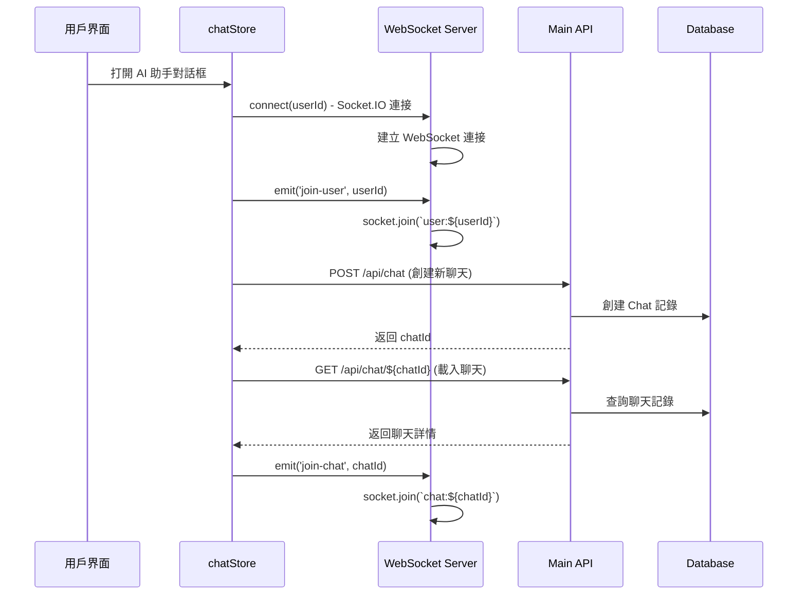
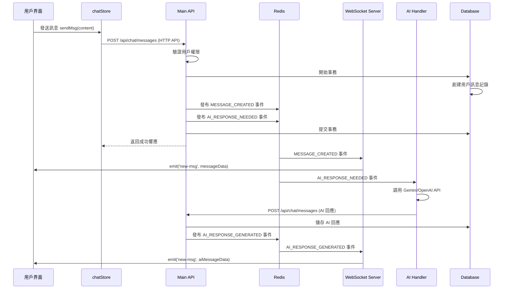

# 架構

## 系統

### 核心
- **認證與授權**: Google OAuth + 基於角色的訪問控制 (RBAC)
- **課程管理**: 老師創建課程、學生註冊、作業提交
- **AI 評分系統**:  (Gemini + OpenAI) 用於評分標準生成
- **實時聊天**: WebSocket 實現的 AI 助手對話系統
- **文件處理**: S3 儲存 + PDF 解析

**WebSocket 實時通訊架構**

### 使用場景
WebSocket **專用於 AI 評分標準助手聊天功能**，提供用戶與 AI 的實時對話體驗。

### 架構設計原則

#### 1. **服務解耦**
- **問題**: 傳統 WebSocket 服務器承擔過多職責
- **解決方案**: WebSocket 專注連接管理，業務邏輯分離到獨立服務

#### 2. **混合通訊模式**
- **發送**: HTTP API (保證可靠性和事務一致性)
- **接收**: WebSocket (實現實時推送)
- **優勢**: 結合了 REST API 的可靠性和 WebSocket 的實時性

#### 3. **事件驅動架構**
- **問題**: 直接調用造成服務耦合
- **解決方案**: Redis Pub/Sub 實現服務間解耦通訊

#### 4. **多設備同步**
- **問題**: localStorage 無法跨設備同步
- **解決方案**: Redis + BroadcastChannel 實現跨設備/標籤頁同步

## 🏗️ **系統架構圖**

### 整體架構
```
┌─────────────────────────────────────────────────────────────────┐
│                        教育評分平台架構                          │
├─────────────────────────────────────────────────────────────────┤
│                                                                 │
│  Frontend (React 19 + React Router v7 + Zustand)               │
│     │                        │                                  │
│     │ HTTP API              │ WebSocket (聊天專用)             │
│     ▼                        ▼                                  │
│  ┌─────────────────────┐   ┌─────────────────────┐              │
│  │    Main API Server  │   │  WebSocket Server   │              │
│  │  (Port 3000)        │   │  (Port 3001)        │              │
│  │  - 認證授權         │   │  - 連接管理         │              │
│  │  - 課程管理         │   │  - 房間管理         │              │
│  │  - 文件上傳         │   │  - 事件廣播         │              │
│  │  - 聊天 API        │   │  - 多設備同步       │              │
│  └─────────────────────┘   └─────────────────────┘              │
│     │           │                    ▲                         │
│     │           │ Events             │ Events                  │
│     │           ▼                    │                         │
│     │  ┌─────────────────────────────────────────────┐              │
│     │  │         Redis Pub/Sub 事件系統          │              │
│     │  │  - chat:events 頻道                     │              │
│     │  │  - 用戶狀態同步                         │              │
│     │  │  - 跨設備消息廣播                       │              │
│     │  └─────────────────────────────────────────────┘              │
│     │           ▲                    │                         │
│     │ Database  │ Cache             │ AI Events               │
│     ▼           ▼                    ▼                         │
│  ┌─────────────────────┐   ┌─────────────────────┐              │
│  │    PostgreSQL       │   │    AI Handler       │              │
│  │  - 用戶與課程       │   │  - Gemini API       │              │
│  │  - 聊天與消息       │   │  - OpenAI Fallback  │              │
│  │  - 評分結果         │   │  - 評分標準生成     │              │
│  │  - 文件記錄         │   │  - 智能回應處理     │              │
│  └─────────────────────┘   └─────────────────────┘              │
│     │                              │                           │
│     │ File Storage                 │ External APIs             │
│     ▼                              ▼                           │
│  ┌─────────────────────┐   ┌─────────────────────┐              │
│  │    MinIO (S3)       │   │   External Services  │              │
│  │  - 文件存儲         │   │  - PDF 解析 API     │              │
│  │  - 多媒體資源       │   │  - Google OAuth      │              │
│  │  - 備份歸檔         │   │  - 第三方集成       │              │
│  └─────────────────────┘   └─────────────────────┘              │
│                                                                 │
└─────────────────────────────────────────────────────────────────┘
```

## 🔄 **WebSocket 完整流程解析**

### **Phase 1: 連接初始化**



### **Phase 2: 訊息發送 (混合模式)**



### **關鍵事件類型**
```typescript
type ChatEvent = {
  type: 'MESSAGE_CREATED' | 'AI_RESPONSE_NEEDED' | 'AI_RESPONSE_GENERATED';
  chatId: string;
  userId: string;
  messageId?: string;
  data?: any;
  timestamp: Date;
};
```

## 🔧 **關鍵技術實現**

### **1. 瘦 WebSocket 服務器設計**
```typescript
// websocket-server/src/handlers.ts
export function setupSocketHandlers(io: Server, socket: Socket) {
  // 只負責連接和房間管理，不處理業務邏輯
  socket.on('join-user', (userId: string) => {
    socket.join(`user:${userId}`);
  });
  
  socket.on('join-chat', (chatId: string) => {
    socket.join(`chat:${chatId}`);
  });
  
  // 已廢棄的直接訊息處理 - 引導使用 API
  socket.on('send-msg', async (data) => {
    socket.emit('api-redirect', {
      message: '請使用 API 端點發送訊息',
      endpoint: '/api/chat/messages'
    });
  });
}
```

### **2. 事件驅動通訊機制**
```typescript
// app/services/events.server.ts
export class EventPublisher {
  static async publishMessageCreated(
    chatId: string, 
    userId: string, 
    messageId: string, 
    messageData?: any
  ) {
    await this.publishChatEvent({
      type: 'MESSAGE_CREATED',
      chatId, userId, messageId,
      data: messageData,
      timestamp: new Date()
    });
  }
  
  static async publishAIResponseNeeded(
    chatId: string, 
    userId: string, 
    messageContent: string
  ) {
    await this.publishChatEvent({
      type: 'AI_RESPONSE_NEEDED',
      chatId, userId,
      data: { messageContent },
      timestamp: new Date()
    });
  }
}
```

### **3. 資料庫事務保證**
```typescript
// app/api/chat/messages.ts
const result = await db.$transaction(async (tx) => {
  // 1. 儲存訊息到資料庫
  const message = await tx.msg.create({
    data: { chatId, role, content }
  });
  
  // 2. 發布事件（在事務外執行以避免阻塞）
  await EventPublisher.publishMessageCreated(
    chatId, userId, message.id, messageData
  );
  
  if (role === 'USER') {
    await EventPublisher.publishAIResponseNeeded(
      chatId, userId, content
    );
  }
  
  return message;
});
```

### **4. 多設備同步實現**
```typescript
// app/services/chat-sync.server.ts
export class ChatSyncService {
  static async updateUserChatState(userId: string, state: any) {
    const key = `user:chat:state:${userId}`;
    
    // Redis 儲存狀態
    await redis.set(key, JSON.stringify({
      ...state,
      lastUpdated: new Date().toISOString()
    }), 'EX', 86400);
    
    // 跨設備事件同步
    await redis.publish(`user:${userId}:sync`, JSON.stringify({
      type: 'CHAT_STATE_UPDATE',
      state,
      timestamp: new Date().toISOString()
    }));
  }
}
```

### **5. AI 服務集成**
```typescript
// websocket-server/src/ai-service.ts
export async function generateRubricResponse(request: RubricGenerationRequest) {
  try {
    // 主要供應商：Gemini
    const response = await callGeminiForRubric(prompt);
    return response;
  } catch (geminiError) {
    // 後備供應商：OpenAI
    try {
      const response = await callOpenAIForRubric(prompt);
      return response;
    } catch (openaiError) {
      throw new Error('AI 服務暫時不可用');
    }
  }
}
```

## 📋 **詳細流程說明**

### **Phase 1: 初始化與連接建立**

| 步驟 | 組件 | 動作 | 檔案位置 | 函數/方法 |
|------|------|------|----------|----------|
| 1 | UI | 開啟 AI 助手對話框 | `AIRubricAssistant.tsx:178` | `useEffect` hook |
| 2 | Store | 建立 WebSocket 連接 | `chatStore.ts:78` | `connect(userId)` |
| 3 | WebSocket | 初始化 Socket.IO 客戶端 | `chatStore.ts:104` | `io(wsUrl, options)` |
| 4 | WebSocket Server | 接受連接 | `websocket-server/src/server.ts:67` | `io.on('connection')` |
| 5 | WebSocket Server | 設置事件處理器 | `websocket-server/src/handlers.ts:10` | `setupSocketHandlers()` |
| 6 | Store | 加入用戶房間 | `chatStore.ts:113` | `socket.emit('join-user')` |
| 7 | API | 創建新聊天 | `app/routes/api.chat.ts:7` | `action()` - POST |
| 8 | Database | 儲存聊天記錄 | `app/routes/api.chat.ts:12` | `db.chat.create()` |
| 9 | Store | 載入聊天詳情 | `chatStore.ts:429` | `openChat(chatId)` |
| 10 | WebSocket | 加入聊天房間 | `chatStore.ts:464` | `socket.emit('join-chat')` |

### **Phase 2: 用戶發送訊息**

| 步驟 | 組件 | 動作 | 檔案位置 | 函數/方法 |
|------|------|------|----------|----------|
| 1 | UI | 用戶點擊發送 | `AIRubricAssistant.tsx:269` | `sendMessage()` |
| 2 | Store | 調用發送方法 | `chatStore.ts:485` | `sendMsg(content)` |
| 3 | API | HTTP POST 請求 | `app/api/chat/messages.ts:15` | `action()` |
| 4 | API | 請求驗證 | `app/api/chat/messages.ts:32` | `validateApiKey()` |
| 5 | API | 用戶授權檢查 | `app/api/chat/messages.ts:37` | `getUser(request)` |
| 6 | API | 防重複檢查 | `app/api/chat/messages.ts:65` | 查詢最近訊息 |
| 7 | Database | 開始事務 | `app/api/chat/messages.ts:91` | `db.$transaction()` |
| 8 | Database | 創建訊息記錄 | `app/api/chat/messages.ts:93` | `tx.msg.create()` |

### **Phase 3: 事件發布與處理**

| 步驟 | 組件 | 動作 | 檔案位置 | 函數/方法 |
|------|------|------|----------|----------|
| 1 | Events | 發布訊息創建事件 | `app/services/events.server.ts:43` | `publishMessageCreated()` |
| 2 | Events | 發布 AI 回應需求事件 | `app/services/events.server.ts:57` | `publishAIResponseNeeded()` |
| 3 | Redis | 事件發布到頻道 | `app/services/events.server.ts:32` | `redis.publish()` |
| 4 | Cache | 快取失效處理 | `app/api/chat/messages.ts:120` | `ChatCacheService.invalidate()` |
| 5 | WebSocket Server | 監聽 Redis 事件 | `websocket-server/src/event-handler.ts:35` | `subscriber.on('message')` |
| 6 | WebSocket Server | 處理訊息創建事件 | `websocket-server/src/event-handler.ts:72` | `handleMessageCreated()` |
| 7 | WebSocket Server | 廣播到聊天室 | `websocket-server/src/event-handler.ts:83` | `io.to().emit('new-msg')` |

### **Phase 4: AI 回應生成**

| 步驟 | 組件 | 動作 | 檔案位置 | 函數/方法 |
|------|------|------|----------|----------|
| 1 | AI Handler | 接收 AI_RESPONSE_NEEDED | `websocket-server/src/event-handler.ts:60` | 事件處理 |
| 2 | AI Service | 調用 AI API | `websocket-server/src/ai-service.ts:5` | `generateRubricResponse()` |
| 3 | AI Service | Gemini API 調用 | `websocket-server/src/ai-service.ts:95` | `callGeminiForRubric()` |
| 4 | AI Service | OpenAI 後備調用 | `websocket-server/src/ai-service.ts:127` | `callOpenAIForRubric()` |
| 5 | API | 儲存 AI 回應 | `app/api/chat/messages.ts:53` | API Key 驗證路徑 |
| 6 | Events | 發布 AI 回應事件 | `app/services/events.server.ts:71` | `publishAIResponseGenerated()` |
| 7 | WebSocket Server | 廣播 AI 回應 | `websocket-server/src/event-handler.ts:96` | `handleAIResponseGenerated()` |
| 8 | Frontend | 接收並顯示 | `chatStore.ts:156` | `socket.on('new-msg')` |

### **關鍵檔案與函數對應**

```typescript
// 核心流程涉及的主要檔案
app/components/AIRubricAssistant.tsx          // UI 界面
app/stores/chatStore.ts                      // 前端狀態管理
app/api/chat/messages.ts                     // 訊息 API 處理
app/services/events.server.ts                // 事件發布系統
websocket-server/src/server.ts               // WebSocket 服務器
websocket-server/src/handlers.ts             // 連接處理
websocket-server/src/event-handler.ts        // 事件監聽處理
websocket-server/src/ai-service.ts           // AI 服務集成
app/services/chat-sync.server.ts             // 多設備同步
```

## ⚠️ **已識別的架構問題與改進建議**

### **1. AI 處理邏輯缺失**
**問題**: 當前 WebSocket 服務器的事件處理器中，`AI_RESPONSE_NEEDED` 事件只是記錄到日誌，實際的 AI 處理邏輯沒有完整實現。

```typescript
// websocket-server/src/event-handler.ts:60-63 - 現況
case 'AI_RESPONSE_NEEDED':
  logger.debug('AI_RESPONSE_NEEDED event received - handled by AI Handler Service');
  break; // 沒有實際處理
```

**改進建議**: 需要實現完整的 AI 事件處理器，或確認 AI Handler Service 的獨立實現。

### **2. 多設備同步實現不完整**
**問題**: `ChatSyncService` 已實現但在實際流程中使用有限，多設備間的狀態同步主要依賴前端的 BroadcastChannel。

**改進建議**: 加強服務器端的狀態同步機制，確保跨設備的數據一致性。

### **3. 錯誤恢復機制待加強**
**問題**: 當 AI 服務失敗或 WebSocket 斷線時，缺乏完整的補償機制。

**改進建議**:
- 實現訊息重試機制
- 加強斷線重連後的狀態恢復
- 實現 AI 服務的降級策略

### **4. 性能優化空間**
**問題**: 
- Redis 主要用於 Socket.IO 適配器，未充分利用其快取能力
- 聊天記錄直接從資料庫查詢，缺乏快取層

**改進建議**:
```typescript
// 建議的快取策略
class ChatCacheService {
  async getCachedMessages(chatId: string, limit: number = 20) {
    const cacheKey = `chat:${chatId}:messages:${limit}`;
    let messages = await redis.get(cacheKey);
    
    if (!messages) {
      messages = await db.msg.findMany({
        where: { chatId },
        take: limit,
        orderBy: { time: 'desc' }
      });
      await redis.setex(cacheKey, 300, JSON.stringify(messages));
    }
    
    return typeof messages === 'string' ? JSON.parse(messages) : messages;
  }
}
```

## 🏆 **架構優勢總結**

### **設計亮點**
1. **混合通訊模式**: HTTP + WebSocket 兼顧可靠性與實時性
2. **事件驅動解耦**: 通過 Redis Pub/Sub 實現服務間解耦
3. **多供應商 AI**: Gemini + OpenAI 雙重保障
4. **服務職責清晰**: WebSocket 專注連接，API 處理業務邏輯
5. **事務一致性**: 資料庫事務確保數據完整性

### **擴展能力**
- 支持水平擴展（Socket.IO Redis 適配器）
- 事件驅動架構易於添加新功能
- 模塊化設計便於維護和升級

### **適用場景**
此架構特別適合需要**實時互動**且**業務邏輯複雜**的教育平台，平衡了開發效率與系統擴展性的需求。