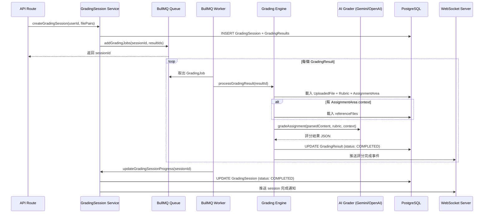

# 專案導覽報告: Grading System (AI-powered 作業評分平台)

> **生成日期**: 2025-11-02
> **目的**: 為新手開發者提供完整的專案理解與 Code Trace 指南
> **適用對象**: 新加入團隊的工程師、維護人員、技術顧問

---

## Section 0: 執行摘要

這是一個**教學場景專用的 AI 智慧評分系統**,解決教師批改大量作業耗時的痛點。

### 使用者視角的核心流程

1. **教師端**: 建立課程 → 定義評分標準 (Rubric) → 發布作業 → 學生提交後,系統自動用 AI (Gemini/OpenAI) 批改 → 教師審閱 AI 評分結果並給最終回饋
2. **學生端**: 用邀請碼加入課程 → 瀏覽作業清單 → 上傳作業檔案 (PDF) → 即時收到 AI 初步評分與建議 → 查看教師最終評語

### 技術實現方式

- 前端使用 **React Router v7** + TypeScript,後端為 **Node.js/Express**,資料庫為 **PostgreSQL** (Prisma ORM)
- 檔案上傳到 **MinIO** (S3 相容),PDF 解析後送 AI 評分
- **BullMQ** 隊列管理評分任務,避免 Gemini API rate limit;**Redis** 作為快取與訊息佇列
- **WebSocket** (Socket.io) 推送即時通知 (新提交、評分完成)
- **雙重 AI 整合**: 優先用 Google Gemini,失敗則降級到 OpenAI (Circuit Breaker 模式)

### 部署架構

Docker Compose 開發環境,Kubernetes 生產環境,支援水平擴展 (WebSocket 透過 Redis Adapter 同步)。

---

## Section 1: 目錄地圖與技術棧偵測

### 1.1 目錄結構樹狀圖

**依據**: `tree` 指令輸出 + 手動分析

```
grading/
├── app/                          # 核心應用程式碼 (React Router v7 SSR)
│   ├── api/                      # API 路由處理器 (後端邏輯)
│   │   ├── grade/                # 評分相關 API
│   │   ├── upload/               # 檔案上傳 API
│   │   ├── files/                # 檔案管理 API
│   │   ├── assignments/          # 作業管理
│   │   ├── teacher/              # 教師端 API
│   │   ├── student/              # 學生端 API
│   │   └── ...
│   ├── routes/                   # 頁面路由 (前端 UI + loader/action)
│   │   ├── teacher/              # 教師平台頁面
│   │   ├── student/              # 學生平台頁面
│   │   └── auth/                 # 認證相關頁面
│   ├── components/               # React UI 元件
│   │   ├── teacher/, student/    # 角色專屬元件
│   │   ├── ui/                   # 通用 UI (Radix UI + shadcn)
│   │   └── grading/, rubrics/    # 功能模組元件
│   ├── services/                 # **核心業務邏輯層** (*.server.ts)
│   │   ├── auth.server.ts        # 認證與授權
│   │   ├── grading-session.server.ts    # 評分會話管理
│   │   ├── bullmq-grading.server.ts     # 非同步評分隊列
│   │   ├── grading-engine.server.ts     # 評分引擎核心
│   │   ├── ai-grader.server.ts          # AI 評分抽象層
│   │   ├── gemini-*.server.ts           # Gemini API 整合
│   │   ├── openai-simple.server.ts      # OpenAI API 整合
│   │   ├── submission.server.ts         # 提交管理
│   │   ├── course.server.ts             # 課程管理
│   │   └── ...                          # 其他業務服務
│   ├── lib/                      # 基礎設施與工具
│   │   ├── db.server.ts          # Prisma 資料庫客戶端
│   │   ├── redis.ts              # Redis 連線設定
│   │   └── websocket/            # WebSocket 工具
│   ├── stores/                   # Zustand 全域狀態管理
│   ├── types/                    # TypeScript 型別定義
│   ├── schemas/                  # Zod 驗證 schema
│   ├── hooks/                    # React 自訂 hooks
│   ├── locales/                  # i18n 翻譯檔 (zh/en)
│   └── entry.server.tsx          # **應用啟動入口** (SSR)
├── prisma/
│   ├── schema.prisma             # **資料庫 Schema 定義**
│   └── migrations/               # 資料庫遷移紀錄
├── websocket-server/             # **獨立 WebSocket 服務**
│   └── src/
│       ├── server.ts             # WebSocket 主程式
│       ├── handlers.ts           # Socket 事件處理器
│       └── event-handler.ts      # Redis Pub/Sub 整合
├── test/                         # 測試套件 (Vitest)
│   ├── unit/                     # 單元測試
│   ├── integration/              # 整合測試
│   ├── contract/                 # API 合約測試
│   ├── load/                     # 負載測試
│   └── factories/, mocks/        # 測試工具
├── k8s/                          # Kubernetes 部署清單
├── docs/                         # 技術文件與 API 規格
├── specs/                        # 功能規格文件
├── docker-compose.dev.yaml       # **開發環境編排**
├── Dockerfile, Dockerfile.dev    # 容器建置檔
└── package.json                  # 專案依賴與腳本
```

### 1.2 技術棧偵測

**依據**: `package.json`, `tsconfig.json`, `docker-compose.dev.yaml`, `prisma/schema.prisma`

#### 核心技術框架

- **語言**: TypeScript 5.1+ (嚴格模式,ES2022 target)
- **前端框架**: React 19 + React Router v7 (非 Remix!)
  - **重要**: 使用 `react-router` 匯入,不是 `@remix-run/*`
  - SSR 渲染模式 (`entry.server.tsx` + `renderToPipeableStream`)
- **建置工具**: Vite 5 (React Router v7 plugin)
- **UI 元件庫**: Radix UI + Tailwind CSS + shadcn/ui
- **狀態管理**: Zustand (全域狀態) + TanStack Query (伺服器狀態)
- **表單處理**: Conform (Zod 整合)

#### 後端與資料層

- **執行環境**: Node.js 20+ (ES Modules)
- **Web 框架**: Express 4 (React Router v7 整合)
- **ORM**: Prisma 6 (輸出到 `app/generated/prisma/client/`)
- **資料庫**: PostgreSQL 16
- **快取/隊列**: Redis 7 + BullMQ 5 (Job Queue)
- **檔案儲存**: MinIO (S3 相容 API,使用 AWS SDK)

#### AI 與外部整合

- **AI SDK**: Vercel AI SDK v5 (`ai` package)
- **Gemini API**: `@google/generative-ai` + `@ai-sdk/google`
- **OpenAI API**: `openai` package v4
- **PDF 解析**: 外部 PDF Parser API (環境變數 `PDF_PARSER_API_URL`)

#### 即時通訊與觀測

- **WebSocket**: Socket.io 4 (獨立服務 + Redis Adapter)
- **認證**: Google OAuth 2.0 (`google-auth-library`)
- **日誌**: Pino (結構化日誌)
- **監控**: 自建 `MonitoringService` (未見第三方 APM)

#### 測試與 CI/CD

- **測試框架**: Vitest 3 + Testing Library + MSW (API mock)
- **容器化**: Docker + Docker Compose (開發) / Kubernetes (生產)
- **CI**: GitHub Actions (`.github/workflows/deploy.yml`)

### 1.3 應用入口與生命週期

**依據**: `app/entry.server.tsx`, `app/services/startup.server.ts`, `app/routes.ts`, `websocket-server/src/server.ts`

#### 主應用啟動流程 (app 服務)

1. **容器啟動** → Docker 執行 `npx react-router dev --host 0.0.0.0` (`docker-compose.dev.yaml:50`)
2. **entry.server.tsx** 觸發 `StartupService.initialize()` (全域單例,利用 Promise 快取避免重複初始化)
3. **StartupService** 執行:
   - 初始化 Circuit Breakers (AI 服務健康檢查)
   - 啟動 **BullMQ Grading Worker** (監聽 `grading` 隊列)
   - 註冊 SIGTERM/SIGINT 優雅關閉處理器 (`startup.server.ts:124-170`)
4. **React Router SSR** 接管請求:
   - 路由定義於 `app/routes.ts` (共 143 行,包含 teacher/student/api 路由)
   - 每個請求觸發對應 `loader` (資料載入) 或 `action` (表單處理)
5. **I18n** 根據 Accept-Language 載入翻譯 (`localization/i18n.server.ts`)

#### WebSocket 服務啟動流程 (websocket 服務)

1. **獨立容器** → `npm run dev` 啟動 (`websocket-server/src/server.ts`)
2. 建立 HTTP server + Socket.io (port 3001)
3. **Redis Adapter** 設定 (支援多 pod 訊息同步,見 `server.ts:29-60`)
4. 監聽 Redis Pub/Sub 頻道:
   - `submission:created` → 推送教師端通知
   - `grading:progress` → 推送評分進度更新
5. Socket 連線後註冊事件處理器 (`handlers.ts`)

#### HTTP 端點註冊

**所有端點定義於** `app/routes.ts`,關鍵端點包含:
- `/api/grade-with-rubric` → 發起評分 (`api/grade/with-rubric.ts`)
- `/api/student/submit` → 學生提交作業
- `/api/teacher/submissions/recent` → 教師查看最新提交
- `/api/files/upload` → 檔案上傳
- `/health` → 健康檢查 (用於 K8s liveness probe)

#### 環境變數載入

**.env 載入順序**: Node.js 自動載入 `.env` (開發) / K8s ConfigMap/Secret (生產)

---

## Section 2: 使用者旅程與端到端流程

### 2.1 核心使用者旅程

**依據**: 從路由結構、API 端點、服務檔案推導

#### Journey 1: 教師建立作業並評分 (端到端)

```
1. [教師登入]
   觸發: GET /auth/google → 跳轉 Google OAuth
   回調: GET /auth/google/callback
   ├─ 呼叫 auth.server.ts:handleGoogleCallback()
   ├─ 建立/更新 User 記錄 (role: TEACHER)
   └─ 設定 session cookie,跳轉到 /teacher

2. [建立課程與班級]
   頁面: GET /teacher/courses/new
   ├─ 表單提交: POST /teacher/courses/new (action)
   └─ 呼叫 course.server.ts:createCourse()
       ├─ Prisma 插入 Course + Class 記錄
       └─ 生成邀請碼 (invitation.server.ts)

3. [定義評分標準 Rubric]
   頁面: GET /teacher/rubrics/new
   ├─ 可選: AI 生成 Rubric (POST /api/ai/rubric-chat)
   │   └─ ai-rubric.server.ts 呼叫 Gemini API
   ├─ 表單提交: POST /teacher/rubrics/new
   └─ rubric.server.ts:createRubric()

4. [發布作業]
   頁面: GET /teacher/courses/:courseId/assignments/new
   ├─ 選擇 Rubric,設定截止日期
   ├─ 上傳參考文件 (可選,Feature 004 AI Context)
   ├─ 提交: POST /teacher/courses/:courseId/assignments/new
   └─ assignment-area.server.ts:createAssignmentArea()
       └─ Prisma 插入 AssignmentArea (含 referenceFileIds)

5. [學生提交作業後,自動評分]
   學生觸發: POST /api/student/submit
   ├─ submission.server.ts:createSubmission()
   │   ├─ 建立 Submission 記錄 (status: SUBMITTED)
   │   └─ WebSocket 通知教師 (via Redis Pub/Sub)
   ├─ 非同步評分 (若設定自動評分):
   │   ├─ 建立 GradingSession + GradingResult
   │   └─ 加入 BullMQ 隊列 (bullmq-grading.server.ts)
   └─ BullMQ Worker 處理:
       ├─ 取出 GradingJob {resultId, userId, sessionId}
       └─ grading-engine.server.ts:processGradingResult()
           ├─ 載入作業上下文 (referenceFiles, customInstructions)
           ├─ 呼叫 ai-grader.server.ts:gradeAssignment()
           │   ├─ 優先: gemini-simple.server.ts (Gemini 2.0)
           │   └─ 降級: openai-simple.server.ts (GPT-4)
           ├─ 解析 AI 回應,計算分數
           ├─ 更新 GradingResult (status: COMPLETED)
           └─ WebSocket 推送評分完成通知

6. [教師審閱評分結果]
   頁面: GET /teacher/submissions/:submissionId/view
   ├─ loader 載入 submission 資料 (含 AI 評分)
   ├─ 教師調整分數或回饋
   ├─ 提交: POST /teacher/submissions/:submissionId/view
   └─ submission.server.ts:updateSubmission()
       ├─ 更新 finalScore, teacherFeedback
       └─ 通知學生 (WebSocket)
```

#### Journey 2: 學生加入課程並提交作業

```
1. [學生登入並選擇角色]
   觸發: GET /auth/google → Google OAuth
   回調: /auth/google/callback
   └─ 若 hasSelectedRole=false,跳轉 /auth/select-role

2. [使用邀請碼加入課程]
   頁面: GET /student/courses/discover
   ├─ 輸入邀請碼
   ├─ POST /api/enrollments
   └─ enrollment.server.ts:enrollStudent()
       ├─ 驗證邀請碼 (未過期,未使用)
       ├─ 建立 Enrollment 記錄 (studentId, classId)
       └─ 標記邀請碼已使用

3. [瀏覽作業列表]
   頁面: GET /student/courses/:courseId
   └─ loader 呼叫 student-course-detail.server.ts
       └─ 查詢該班級的 AssignmentArea (含 Submission 狀態)

4. [上傳作業檔案]
   頁面: GET /student/assignments/:assignmentId/submit
   ├─ 檔案上傳: POST /api/files/upload
   │   └─ storage.server.ts:uploadFileToMinIO()
   ├─ 解析 PDF (外部 API 或內建解析器)
   └─ 標記檔案 parseStatus: COMPLETED

5. [正式提交作業]
   觸發: POST /api/student/submit
   └─ 流程同 Journey 1 步驟 5 (觸發自動評分)

6. [查看評分結果]
   頁面: GET /student/submissions/:submissionId
   └─ 顯示 AI 評分細節、教師最終評語
```

### 2.2 非同步評分流程詳解 (關鍵時序)

**依據**: `bullmq-grading.server.ts`, `grading-engine.server.ts`



**關鍵設計決策**:
1. **為何用 BullMQ?** Gemini API 有 15 RPM 限制,BullMQ 提供 rate limiting + 失敗重試
2. **優雅降級**: Circuit Breaker 模式,Gemini 失敗自動切換 OpenAI
3. **進度追蹤**: Redis 儲存即時進度,前端透過 WebSocket 訂閱 `grading:progress` 事件

---

## Section 3: 資料模型與外部整合

### 3.1 核心資料表與關聯

**依據**: `prisma/schema.prisma`

#### 主要實體與關係

```
User (使用者)
├── role: UserRole (STUDENT | TEACHER)
├── hasSelectedRole: Boolean (是否已選角色)
├─┬─ 1:N → Course (作為教師建立的課程)
│ ├─ 1:N → Rubric (建立的評分標準)
│ ├─ 1:N → GradingSession (評分會話)
│ └─ 1:N → Submission (學生作業)
└─── N:M → Class (透過 Enrollment 加入班級)

Course (課程)
├── teacherId → User (教師)
├── code: String (課程代碼,如 "CS101")
├─┬─ 1:N → Class (班級/班次)
│ ├─ 1:N → AssignmentArea (作業區)
│ └─ 1:N → InvitationCode (邀請碼)

Class (班次/班級)
├── courseId → Course
├── schedule: Json (上課時間,彈性結構)
├── capacity: Int? (人數上限)
├── assistantId → User? (助教)
└─┬─ 1:N → Enrollment (學生註冊)
  └─ 1:N → AssignmentArea (班級專屬作業)

AssignmentArea (作業)
├── courseId → Course
├── classId → Class? (null=全課程作業)
├── rubricId → Rubric (評分標準)
├── dueDate: DateTime?
├── referenceFileIds: String? (JSON 陣列,最多5個檔案)
├── customGradingPrompt: String? (客製化評分指示)
└─┬─ 1:N → Submission (學生提交)
  └─ 1:N → GradingResult (評分結果)

Submission (學生提交)
├── studentId → User
├── assignmentAreaId → AssignmentArea
├── filePath: String (MinIO S3 路徑)
├── status: SubmissionStatus (DRAFT | SUBMITTED | ANALYZED | GRADED)
├── aiAnalysisResult: Json? (AI 初步評分)
├── thoughtSummary: String? (AI 思考摘要)
├── finalScore: Int? (最終分數)
├── normalizedScore: Float? (100分制)
├── teacherFeedback: String?
└── usedContext: Json? (評分時使用的上下文資訊)

GradingSession (評分會話)
├── userId → User
├── status: GradingSessionStatus
├── progress: Int (0-100)
└─── 1:N → GradingResult

GradingResult (單次評分結果)
├── gradingSessionId → GradingSession
├── uploadedFileId → UploadedFile
├── rubricId → Rubric
├── assignmentAreaId → AssignmentArea?
├── status: GradingStatus
├── result: Json (詳細評分 breakdown)
├── thoughtSummary: String? (AI 思考過程)
├── usedContext: Json? (透明度資訊)
├── normalizedScore: Float?
└── gradingModel: String? (使用的 AI 模型)

Rubric (評分標準)
├── userId → User
├── teacherId → User?
├── isTemplate: Boolean
├── isActive: Boolean
├── version: Int
└── criteria: Json (評分準則結構)

UploadedFile (上傳檔案)
├── userId → User
├── fileKey: String @unique (MinIO S3 key)
├── parseStatus: FileParseStatus
├── parsedContent: String?
├── isDeleted: Boolean (軟刪除)
└── expiresAt: DateTime?
```

#### 重要 JSON 結構說明

**Rubric.criteria** (評分準則):
```typescript
[
  {
    id: string,
    name: string,         // 如 "內容完整性"
    description: string,
    maxScore: number,
    levels: [
      { score: number, description: string }
    ]
  }
]
```

**GradingResult.result** (評分結果):
```typescript
{
  totalScore: number,
  maxScore: number,
  breakdown: [
    {
      criteriaId: string,
      score: number,
      feedback: string
    }
  ],
  overallFeedback: string
}
```

**GradingResult.usedContext** (透明度追蹤):
```typescript
{
  assignmentAreaId: string,
  referenceFilesUsed: [
    {
      fileId: string,
      fileName: string,
      contentLength: number,
      wasTruncated: boolean
    }
  ],
  customInstructionsUsed: boolean
}
```

### 3.2 資料庫索引策略

**依據**: `prisma/schema.prisma` 中的 `@@index` 宣告

**效能關鍵索引**:
1. `Course`: `@@index([teacherId])`, `@@index([code])`
2. `Class`: `@@index([courseId])`, `@@index([assistantId])`
3. `AssignmentArea`: `@@index([courseId])`, `@@index([classId])`, `@@index([rubricId])`
4. `Submission`: `@@index([studentId])`, `@@index([assignmentAreaId])`, `@@index([status])`
5. `GradingResult`: `@@index([gradingSessionId, status])`, `@@index([assignmentAreaId])`, `@@index([normalizedScore])`
6. `UploadedFile`: `@@index([userId, parseStatus])`, `@@index([userId, isDeleted])`, `@@index([expiresAt])`
7. `Enrollment`: `@@unique([studentId, classId])` (防止重複註冊)

**潛在 N+1 風險**:
- 載入所有提交時,若未用 Prisma `include`,會產生 N+1 查詢
- **緩解**: 使用 `include: { student: true, assignmentArea: true }`

### 3.3 外部系統整合

#### 1. MinIO (物件儲存)
- **用途**: 儲存 PDF 檔案、參考文件
- **連線**: `app/config/storage.ts`, `app/services/storage.server.ts`
- **Bucket**: `grading-files`
- **API**: AWS S3 SDK (`@aws-sdk/client-s3`)
- **關鍵操作**: `uploadFileToMinIO()`, `getPresignedDownloadUrl()`

#### 2. Redis (快取 + 訊息佇列)
- **用途**:
  - BullMQ 任務佇列
  - Socket.io Adapter (多 pod 訊息同步)
  - 快取、進度追蹤 (Redis Pub/Sub)
- **連線**: `app/lib/redis.ts`
- **客戶端**: `ioredis`

#### 3. Google Gemini API
- **模型**: Gemini 2.0 Flash Experimental
- **SDK**: `@google/generative-ai` + `@ai-sdk/google`
- **API Key 輪替**: 支援 3 組 API Key
- **Rate Limiting**: 15 requests/min (透過 BullMQ 限流)
- **熔斷器**: `circuit-breaker.server.ts` 監控失敗率

#### 4. OpenAI API
- **用途**: Gemini 失敗時的備援
- **模型**: GPT-4
- **SDK**: `openai` package v4

#### 5. PDF Parser API (外部服務)
- **環境變數**: `PDF_PARSER_API_URL`
- **用途**: PDF 轉純文字
- **呼叫點**: `pdf-parser.server.ts`
- **超時**: 預設 30 秒

#### 6. Google OAuth 2.0
- **SDK**: `google-auth-library`
- **Scope**: `userinfo.profile`, `userinfo.email`
- **Callback URL**: `GOOGLE_REDIRECT_URI`
- **Session**: 加密 cookie (secret: `AUTH_SECRET`)

### 3.4 資料一致性策略

#### Cascade 刪除鏈
```
User 刪除 → CASCADE 刪除:
  ├─ Course → AssignmentArea → Submission
  ├─ Rubric → ⚠️ RESTRICT (有使用時無法刪除)
  ├─ GradingSession → GradingResult
  └─ UploadedFile

Course 刪除 → CASCADE 刪除:
  ├─ Class → Enrollment, AssignmentArea
  └─ InvitationCode
```

#### 軟刪除
- **UploadedFile** 使用 `isDeleted` + `deletedAt` (資料保留,查詢過濾)
- **清理機制**: `@@index([expiresAt])` 支援定期清理過期檔案

---

## Section 4: 模組導覽

### 4.1 模組分組概覽

```
1. 認證與授權 (Auth)
2. 課程與作業管理 (Course Management)
3. 學生提交與評分 (Submission & Grading)
4. AI 評分引擎 (AI Grading)
5. 檔案處理 (File Handling)
6. 即時通訊 (Real-time Communication)
7. 前端 UI 元件 (Frontend Components)
8. 共享工具與設定 (Shared Utilities)
```

---

### 4.2 模組 1: 認證與授權 (Auth)

**職責**: 使用者登入、角色選擇、Session 管理、權限檢查
**耦合點**: 所有受保護的 API 路由、前端 loader 函數

#### 檔案清單
| 路徑 | 用途 |
|------|------|
| `app/services/auth.server.ts` | 核心認證邏輯 (Google OAuth、session 管理) |
| `app/sessions.server.ts` | Express session 設定 (加密 cookie) |
| `app/middleware/auth.server.ts` | 權限檢查中介軟體 |
| `app/routes/auth/google.tsx` | 發起 Google OAuth 流程 |
| `app/routes/auth/google.callback.tsx` | OAuth 回調處理 |
| `app/routes/auth/select-role.tsx` | 角色選擇頁面 |
| `app/routes/auth/logout.tsx` | 登出 |

#### 檔案詳解: `app/services/auth.server.ts`

**角色**: 認證服務核心,處理 Google OAuth 流程與 session 管理

**對外介面**:
1. `getUserId(request: Request): Promise<string | null>`
   - 從 session cookie 提取 userId
   - **呼叫點**: 所有需要認證的 loader/action

2. `googleLogin(): Promise<Response>`
   - 生成 Google OAuth 授權 URL,跳轉到 Google 登入頁

3. `handleGoogleCallback(request: Request): Promise<Response>`
   - 處理 Google OAuth callback
   - 建立或更新 User 記錄
   - 設定 session cookie
   - **跳轉邏輯**:
     - 若 `hasSelectedRole=false` → `/auth/select-role`
     - 若 `role=TEACHER` → `/teacher`
     - 若 `role=STUDENT` → `/student`

**控制流程**:
```typescript
// handleGoogleCallback 邏輯步驟
1. 從 URL query 取得 authorization code
2. oauth2Client.getToken(code) 交換 access token
3. oauth2Client.verifyIdToken() 驗證 ID token
4. 從 payload 提取 email, name, picture
5. Prisma upsert User (email 唯一索引)
6. 設定 session.set('userId', user.id)
7. 返回 redirect(destinationUrl) + Set-Cookie header
```

**安全與權限**:
- **CSRF 防護**: OAuth state parameter (未見實作,**潛在風險**)
- **Session 加密**: 使用 `AUTH_SECRET` 加密 cookie
- **HTTPS only**: 生產環境應設定 `secure: true`

**可追蹤路徑**:
```
使用者點擊「Google 登入」
→ GET /auth/google
→ auth.server.ts:googleLogin()
→ redirect 到 Google OAuth 頁面
→ 使用者授權後,Google callback 到 /auth/google/callback
→ auth.server.ts:handleGoogleCallback()
  ├─ 驗證 token → 建立/更新 User
  ├─ 設定 session cookie
  └─ redirect 到對應平台
```

---

### 4.3 模組 2: 課程與作業管理 (Course Management)

**職責**: 教師建立課程/班級/作業、學生註冊課程
**耦合點**: 與 Rubric 模組、與 Submission 模組

#### 核心服務檔案
| 路徑 | 用途 |
|------|------|
| `app/services/course.server.ts` | 課程 CRUD |
| `app/services/class.server.ts` | 班級管理 |
| `app/services/assignment-area.server.ts` | 作業區管理 (含 AI 上下文載入) |
| `app/services/enrollment.server.ts` | 學生註冊 |
| `app/services/invitation.server.ts` | 邀請碼生成與驗證 |

#### 檔案詳解: `app/services/assignment-area.server.ts`

**角色**: 作業區服務,處理作業建立、載入參考文件

**對外介面**:
1. `createAssignmentArea(data): Promise<AssignmentArea>`
   - 建立作業,關聯 Rubric
   - 儲存 `referenceFileIds` (JSON 陣列) 與 `customGradingPrompt`

2. `loadReferenceDocuments(assignmentAreaId): Promise<{files, truncated}>`
   - **關鍵功能**: 載入作業設定的參考文件內容 (最多 5 個)
   - **截斷邏輯**: 單檔超過 10,000 字元會截斷
   - **呼叫點**: `grading-engine.server.ts:130` (評分前載入上下文)

3. `getCustomGradingInstructions(assignmentAreaId): Promise<string | null>`
   - 載入教師自訂評分指示

**典型呼叫路徑**:
```
教師建立作業並上傳參考文件
→ POST /teacher/courses/:courseId/assignments/new
→ assignment-area.server.ts:createAssignmentArea()
→ Prisma INSERT AssignmentArea

學生提交作業觸發評分
→ grading-engine.server.ts:processGradingResult()
→ assignment-area.server.ts:loadReferenceDocuments()
→ 返回參考文件內容 → 注入 AI prompt
```

---

### 4.4 模組 3: 學生提交與評分 (Submission & Grading)

**職責**: 管理學生作業提交、評分會話建立、BullMQ 隊列處理、AI 評分引擎
**耦合點**: 與 AI 模組、與 WebSocket 模組

#### 核心服務檔案
| 路徑 | 用途 |
|------|------|
| `app/services/submission.server.ts` | 提交 CRUD |
| `app/services/grading-session.server.ts` | 評分會話管理 |
| `app/services/bullmq-grading.server.ts` | BullMQ 隊列與 Worker |
| `app/services/grading-engine.server.ts` | **核心評分引擎** |
| `app/services/grading-result.server.ts` | 評分結果查詢 |
| `app/services/worker-init.server.ts` | Worker 初始化 |

#### 檔案詳解: `app/services/grading-engine.server.ts`

**角色**: 評分引擎核心,處理單次評分任務的完整流程

**對外介面**:
```typescript
processGradingResult(
  resultId: string,
  userId: string,
  sessionId: string,
  userLanguage: 'zh' | 'en' = 'zh'
): Promise<{success: boolean, error?: string}>
```

**控制流程** (關鍵步驟):
```typescript
1. 載入 GradingResult (include: uploadedFile, rubric, assignmentArea)
2. 驗證狀態 (若已完成則跳過,允許重試)
3. 檢查前置條件 (uploadedFile.parseStatus 必須為 COMPLETED)
4. 載入 AI 上下文:
   - loadReferenceDocuments(assignmentAreaId)
   - getCustomGradingInstructions(assignmentAreaId)
5. 解析 Rubric criteria (JSON → 結構化物件)
6. 呼叫 AI 評分:
   getAIGrader().gradeAssignment({
     studentWork: uploadedFile.parsedContent,
     rubric: parsedCriteria,
     referenceDocuments: contextFiles,
     customInstructions: customPrompt,
     language: userLanguage
   })
7. 解析 AI 回應,計算 normalizedScore
8. 更新資料庫 (status: COMPLETED, result, usedContext)
9. 更新 GradingSession 進度
10. 返回 {success: true}
```

**效能考量**:
- **瓶頸**: AI API 延遲 (平均 10-30 秒/request)
- **並發限制**: BullMQ Worker concurrency=5
- **優化**: 使用 BullMQ rate limiter (15 requests/min)

**典型呼叫鏈**:
```
學生提交作業
→ POST /api/student/submit
→ submission.server.ts:createSubmission()
→ grading-session.server.ts:createGradingSession()
→ bullmq-grading.server.ts:addGradingJobs()

BullMQ Worker 自動觸發
→ grading-engine.server.ts:processGradingResult()
  ├─ 載入上下文
  ├─ 呼叫 AI 評分
  └─ 更新 GradingResult
→ WebSocket 推送 'grading:completed' 事件
```

---

#### 檔案詳解: `app/services/bullmq-grading.server.ts`

**角色**: BullMQ 隊列管理,處理非同步評分任務

**對外介面**:
1. `addGradingJobs(sessionId, jobs): Promise<void>`
   - 批次加入評分任務到隊列

2. `getQueueStatus(): Promise<{waiting, active, completed, failed}>`
   - 查詢隊列狀態

3. `closeGradingServices(): Promise<void>`
   - 優雅關閉 Worker 與 Queue

**控制流程** (Worker 初始化):
```typescript
1. 建立 Redis 連線
2. 建立 Queue('grading', {connection: redis})
3. 建立 Worker('grading', async (job) => {
     await processGradingResult(job.data.resultId, ...);
   }, {
     concurrency: 5,
     limiter: {
       max: 15,        // 最多 15 個請求
       duration: 60000 // 每分鐘
     }
   })
4. 註冊事件監聽器 (completed, failed)
5. 儲存到全域 state (避免 HMR 重複建立)
```

---

### 4.5 模組 4: AI 評分引擎 (AI Grading)

**職責**: 整合多個 AI 服務、Circuit Breaker、Prompt 生成、API Key 輪替
**耦合點**: 與 Grading Engine、與外部 Gemini/OpenAI API

#### 核心服務檔案
| 路徑 | 用途 |
|------|------|
| `app/services/ai-grader.server.ts` | AI 評分抽象層 |
| `app/services/gemini-simple.server.ts` | Gemini API 呼叫 |
| `app/services/gemini-rotating.server.ts` | API Key 輪替邏輯 |
| `app/services/gemini-prompts.server.ts` | Prompt 模板生成 |
| `app/services/openai-simple.server.ts` | OpenAI 備援 |
| `app/services/circuit-breaker.server.ts` | 熔斷器 |
| `app/services/ai-protected.server.ts` | Circuit Breaker 包裝 |

**模組設計模式**: **策略模式 + 熔斷器模式**

#### 關鍵檔案簡述

**`app/services/gemini-prompts.server.ts`**
- **職責**: 生成結構化 prompt
- **關鍵邏輯**:
  ```typescript
  function buildGradingPrompt({rubric, referenceDocuments, customInstructions, language}) {
    let prompt = `你是一位專業的作業評分助手...`;
    if (referenceDocuments) {
      prompt += `\n參考文件:\n${referenceDocuments.map(d => d.content).join('\n')}`;
    }
    if (customInstructions) {
      prompt += `\n特別指示:\n${customInstructions}`;
    }
    prompt += `\n評分標準:\n${JSON.stringify(rubric)}`;
    return prompt;
  }
  ```

**`app/services/circuit-breaker.server.ts`**
- **狀態機**: CLOSED → OPEN → HALF_OPEN → CLOSED
- **觸發條件**: 5 分鐘內失敗率超過 50% → OPEN
- **恢復機制**: OPEN 狀態 30 秒後進入 HALF_OPEN

---

### 4.6 模組 5: 檔案處理 (File Handling)

**職責**: 檔案上傳 (MinIO)、PDF 解析、檔案管理
**耦合點**: 與 Submission、與 AI Grading

#### 核心檔案
| 路徑 | 用途 |
|------|------|
| `app/services/storage.server.ts` | MinIO 上傳/下載 |
| `app/services/pdf-parser.server.ts` | PDF 解析 |
| `app/services/uploaded-file.server.ts` | 檔案記錄 CRUD |
| `app/api/files/upload.ts` | 檔案上傳 API |

**關鍵流程**:
```
前端上傳檔案
→ POST /api/files/upload
→ storage.server.ts:uploadFileToMinIO()
  ├─ S3Client.send(PutObjectCommand) → MinIO
  └─ 返回 fileKey
→ uploaded-file.server.ts:createUploadedFile()
→ (非同步) pdf-parser.server.ts:parsePDF()
  └─ UPDATE UploadedFile (parseStatus: COMPLETED)
```

---

### 4.7 模組 6: 即時通訊 (Real-time Communication)

**職責**: WebSocket 連線管理、事件推送、Redis Pub/Sub
**耦合點**: 與 Grading Engine、與 Submission

#### 核心檔案
| 路徑 | 用途 |
|------|------|
| `websocket-server/src/server.ts` | WebSocket 主服務 |
| `websocket-server/src/handlers.ts` | Socket 事件處理器 |
| `websocket-server/src/event-handler.ts` | Redis Pub/Sub 訂閱 |
| `app/services/notification.server.ts` | 通知發送 |

**事件流程**:
```
BullMQ Worker 完成評分
→ grading-engine.server.ts
→ notification.server.ts:publishGradingCompleted()
  └─ Redis PUBLISH 'grading:completed'

WebSocket Server
→ event-handler.ts 訂閱 Redis
→ 收到訊息 → 找出 Socket 連線
→ socket.emit('grading:completed', data)

前端 React
→ useAssignmentWebSocket hook 監聽
→ 更新 Zustand store
→ UI 顯示通知
```

---

## Section 5: 設定、可觀測性、安全

### 5.1 環境變數與設定

#### 必需環境變數
| 變數名稱 | 預設值 | 用途 | 缺失影響 |
|---------|--------|------|---------|
| `DATABASE_URL` | `postgresql://...` | PostgreSQL 連線 | **致命** |
| `REDIS_HOST` | `redis` | Redis 主機 | **致命** |
| `AUTH_SECRET` | (無) | Session 加密金鑰 | **安全風險** |
| `GOOGLE_CLIENT_ID` | (無) | Google OAuth | 無法登入 |
| `GEMINI_API_KEY` | (無) | Gemini AI | 無法評分 |
| `OPENAI_API_KEY` | (無) | OpenAI 備援 | 無備援 |
| `MINIO_ENDPOINT` | `minio` | MinIO 主機 | 檔案上傳失敗 |

#### 可選環境變數
- `PDF_PARSER_API_URL`: 外部 PDF 解析服務
- `GEMINI_API_KEY2`, `GEMINI_API_KEY3`: API Key 輪替
- `WEBSOCKET_ALLOWED_ORIGINS`: CORS 允許來源

**敏感資訊管理**:
- **開發**: `.env` 檔案 (已加入 `.gitignore`)
- **生產**: Kubernetes Secret (base64 編碼)

### 5.2 可觀測性

#### 日誌系統
- **框架**: Pino (結構化 JSON 日誌)
- **格式**: `{"level":30,"time":...,"msg":"...","context":{...}}`
- **輸出**: stdout (Docker 收集)

**關鍵日誌點**:
1. 認證: `auth.server.ts` 記錄 OAuth 設定
2. 評分: `grading-logger.server.ts` 記錄完整評分過程
3. API 錯誤: 所有 catch 區塊

**缺失**:
- 無 Trace ID (建議加入 `pino-http`)
- 無 Prisma 慢查詢監控

#### 除錯建議
```bash
# 本地重現
docker-compose -f docker-compose.dev.yaml up -d
docker logs -f grading-app-1

# 查詢評分日誌
SELECT * FROM grading_results WHERE status='FAILED' ORDER BY createdAt DESC LIMIT 10;

# Redis 隊列狀態
redis-cli -a dev_password
> LLEN bull:grading:wait
```

### 5.3 安全與合規

#### 認證與授權
- **認證**: Google OAuth 2.0
- **Session**: 加密 cookie (httpOnly, sameSite: lax)
- **授權**: loader 檢查 `getUserId()`
- **角色隔離**: Teacher/Student 路由分離

**潛在風險**:
1. **CSRF**: OAuth 缺少 state parameter (**高風險**)
2. **Session 固定**: 登入後未更新 session ID
3. **XSS**: 使用 `react-markdown` 需確認 sanitize 設定

#### 輸入驗證
- **Zod Schema**: 所有 API 輸入驗證
- **檔案上傳**: MIME type 檢查 + 10MB 限制
- **SQL Injection**: Prisma ORM 自動參數化 (安全)

---

## Section 6: 風險、缺口、改進建議

### 6.1 高風險問題 (立即修復)

| 風險 | 位置 | 影響 | 建議修復 | 驗證方式 |
|------|------|------|---------|---------|
| **CSRF 攻擊** | `auth.server.ts:45` | 攻擊者可偽造 OAuth callback | 加入 `state` parameter | 測試偽造 callback |
| **Session 固定** | `auth.server.ts:102` | 登入後未更新 session ID | 呼叫 `session.regenerate()` | 檢查登入前後 cookie |
| **API Key 洩漏** | 日誌輸出 | 金鑰可能記錄到日誌 | 使用 pino-redact 遮蔽 | 搜尋日誌 `grep "sk-"` |
| **未限速 API** | `api/files/upload.ts` | 惡意上傳大量檔案 | 加入 rate limiter | ab 壓測 |

### 6.2 效能瓶頸

| 瓶頸 | 位置 | 現象 | 短期優化 | 長期方案 |
|------|------|------|---------|---------|
| **N+1 查詢** | `submissions.tsx` | 100 個提交查詢 101 次 | 使用 `include` | 改用 DataLoader |
| **AI 評分延遲** | `grading-engine` | 單次 10-30 秒 | 增加 concurrency | Gemini Batch API |
| **參考文件載入** | `assignment-area` | 每次重複載入 | Redis 快取 | presigned URL |

### 6.3 測試覆蓋缺口

| 未測功能 | 風險等級 | 建議測試 |
|---------|---------|---------|
| 參考文件載入失敗 | 高 | 單元測試: mock parsedContent=null |
| AI 返回格式錯誤 | 高 | 整合測試: mock 非 JSON |
| Redis 斷線恢復 | 中 | 整合測試: 中途停止 Redis |
| OAuth state parameter | 高 | 安全測試: 偽造 state |

### 6.4 架構改進建議

#### 短期 (1-2 週)
1. 加入 Request ID (安裝 `pino-http`)
2. API 限速 (使用 `express-rate-limit`)
3. CSRF 防護 (OAuth state parameter)

#### 中期 (1-2 月)
1. 快取層優化 (Redis 快取熱門查詢)
2. 資料庫查詢優化 (監控慢查詢)
3. 錯誤處理統一 (全域錯誤處理器)

#### 長期 (3-6 月)
1. 遷移到 Gemini Batch API
2. 引入 APM (OpenTelemetry)
3. 資料歸檔策略 (1 年前資料歸檔)

---

## 附錄 A: 端點/事件/任務一覽表

### HTTP API 端點

| 方法 | 路徑 | 用途 | 認證 |
|------|------|------|------|
| POST | `/api/grade-with-rubric` | 發起評分 |   |
| GET | `/api/grade-progress` | 查詢評分進度 |   |
| POST | `/api/student/submit` | 學生提交作業 |   STUDENT |
| POST | `/api/files/upload` | 上傳檔案 |   |
| POST | `/api/enrollments` | 使用邀請碼註冊 |   STUDENT |
| GET | `/api/courses/discover` | 搜尋課程 |   |
| POST | `/api/ai/rubric-chat` | AI 生成評分標準 |   |
| GET | `/health` | 健康檢查 | ❌ |

### WebSocket 事件

| 事件名稱 | 方向 | Payload | 用途 |
|---------|------|---------|------|
| `grading:progress` | Server→Client | `{sessionId, progress}` | 推送評分進度 |
| `grading:completed` | Server→Client | `{resultId, score}` | 評分完成通知 |
| `submission:created` | Server→Client | `{submissionId}` | 新提交通知 |
| `join:room` | Client→Server | `{userId, role}` | 加入 room |

### BullMQ 任務

| 隊列 | Job 資料 | 處理器 | Concurrency | Rate Limit |
|------|---------|--------|------------|-----------|
| `grading` | `{resultId, userId, sessionId}` | `grading-engine.server.ts` | 5 | 15 req/min |

---

## 附錄 B: 呼叫圖與依賴關係摘要

### 核心服務依賴圖

```
認證層:
  auth.server.ts → sessions.server.ts, db.server.ts

評分核心:
  grading-session.server.ts → bullmq-grading.server.ts
  bullmq-grading.server.ts → grading-engine.server.ts
  grading-engine.server.ts → assignment-area.server.ts, ai-grader.server.ts

AI 服務:
  ai-grader.server.ts → ai-protected.server.ts → circuit-breaker.server.ts
  ai-grader.server.ts → gemini-simple.server.ts / openai-simple.server.ts

即時通訊:
  notification.server.ts → Redis Pub/Sub
  websocket-server/event-handler.ts → Socket.io emit
```

---

## 附錄 C: Trace 指南

### Trace 案例 1: 學生提交作業到收到評分

#### 完整檔案追蹤路徑
```
routes/student/assignments/$assignmentId.submit.tsx (前端)
  → api/student/submit.ts (API 路由)
    → services/submission.server.ts (業務邏輯)
      ├─→ services/notification.server.ts (WebSocket 通知)
      └─→ services/grading-session.server.ts (評分會話)
          → services/bullmq-grading.server.ts (隊列)
            → services/grading-engine.server.ts (評分引擎)
              ├─→ services/assignment-area.server.ts (上下文)
              ├─→ services/ai-grader.server.ts (AI 評分)
              │   └─→ services/gemini-simple.server.ts (Gemini)
              └─→ services/notification.server.ts (完成通知)
                  → websocket-server/src/event-handler.ts (推送)
```

#### Step-by-Step 追蹤步驟

1. **定位前端元件**: `app/routes/student/assignments/$assignmentId.submit.tsx`
   - 搜尋 `"submit"` 按鈕的 onClick handler
   - 找到 `fetch('/api/student/submit')`

2. **追蹤 API 路由**: `app/routes.ts` 搜尋 `/api/student/submit`
   - 找到路由定義 (第 128 行)

3. **進入服務層**: `app/services/submission.server.ts`
   - `createSubmission()` 函數

4. **資料庫寫入**: `submission.server.ts:43`
   - `db.submission.create()`

5. **WebSocket 通知**: `notification.server.ts`
   - `redis.publish('submission:created')`

6. **評分流程**: `grading-session.server.ts`
   - `createGradingSession()` → `addGradingJobs()`

7. **AI 評分**: `grading-engine.server.ts`
   - `processGradingResult()` → `getAIGrader().gradeAssignment()`

---

### Trace 案例 2: 評分失敗除錯

**現象**: 前端顯示「評分失敗」

#### 除錯步驟

1. **前端檢查**: DevTools Network → WebSocket 訊息
   - 收到: `{event: 'grading:failed', resultId: 'xxx', error: 'AI timeout'}`

2. **資料庫查詢**:
   ```sql
   SELECT * FROM grading_results WHERE id='xxx';
   ```

3. **日誌追蹤**:
   ```bash
   docker logs grading-app-1 | grep "resultId=xxx"
   ```

4. **定位程式碼**:
   ```bash
   grep -r "timeout after" app/services/
   ```
   - 找到: `gemini-simple.server.ts`

5. **修復**: 增加 timeout 或優化 prompt

6. **重新評分**:
   ```sql
   UPDATE grading_results SET status='PENDING' WHERE id='xxx';
   ```

---

## 總結與下一步

**報告完整度**:   已覆蓋所有要求的 Section

**建議後續行動**:
1. 實作高風險修復 (CSRF、Session 固定、API 限速)
2. 加入 Request ID 與錯誤追蹤
3. 建立 Grafana dashboard 監控關鍵指標
4. 撰寫新手上手文件

**使用此報告的方式**:
- **新人 onboarding**: 從 Section 0 開始理解系統
- **Bug 追蹤**: 使用附錄 C 的 Trace 指南
- **重構規劃**: 參考 Section 6 的改進建議
- **Code Review**: 對照 Section 4 的檔案詳解
