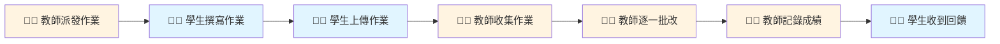
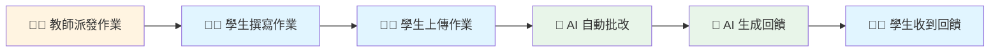
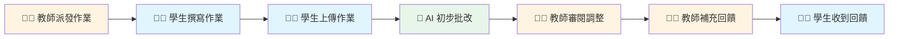

# 作業批改流程圖比較

## HI (Human Intelligence) - 人工批改流程

**時間軸：**
- 派發作業 → 批改完成：**7-14 天**
- 學生等待回饋時間：**5-10 天**

**特點：**
-   深度個人化回饋
-   理解學生思維
- ❌ 批改時間長
- ❌ 學生等待久

---

## AI (Artificial Intelligence) - 自動批改流程

**時間軸：**
- 派發作業 → 批改完成：**2-3 天**
- 學生等待回饋時間：**1 分鐘內**

**特點：**
-   即時回饋
-   評分一致
- ❌ 缺乏人性溫度
- ❌ 難以理解創意思維

---

## HI + AI 協作批改流程

**時間軸：**
- 派發作業 → 批改完成：**3-5 天**
- 學生等待回饋時間：**2-3 天**

**特點：**
-   兼顧速度與品質
-   評分一致且有溫度
-   教師專注高價值工作
-   學生獲得完整回饋

---

## 三種方式比較表

| 項目 | HI 人工批改 | AI 自動批改 | HI + AI 協作 |
|------|-----------|-----------|------------|
| **批改速度** | 慢 (10-30min/份) | 快 (30-60sec/份) | 中 (2-5min/份) |
| **一致性** | 低-中 | 高 | 高 |
| **成本** | 高 | 低 | 中 |
| **個人化** | 高 | 中 | 高 |
| **可擴展性** | 低 | 高 | 中-高 |
| **適用情境** | 小班、主觀題 | 大班、客觀題 | 中大班、混合題型 |
| **教師負擔** | 重 | 輕 | 中 |
| **學生體驗** | 溫暖但等待久 | 快速但制式 | 兼顧速度與溫度 |
