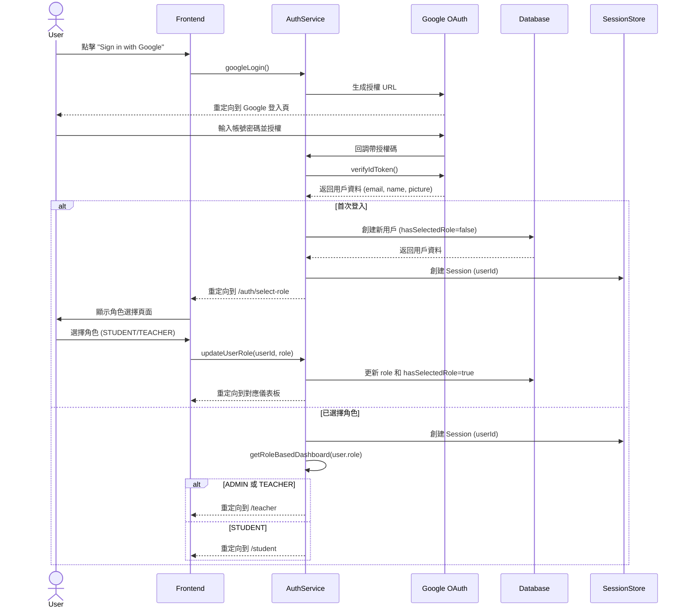
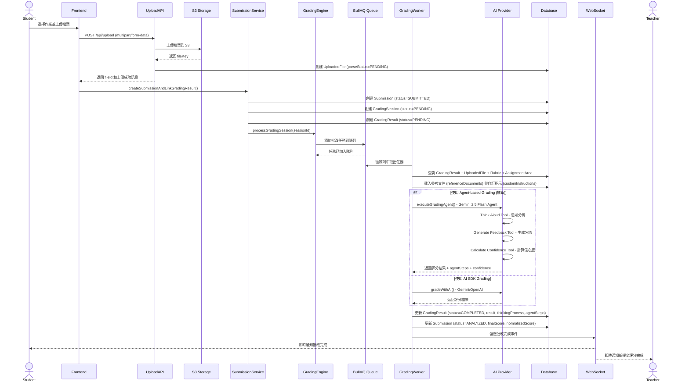
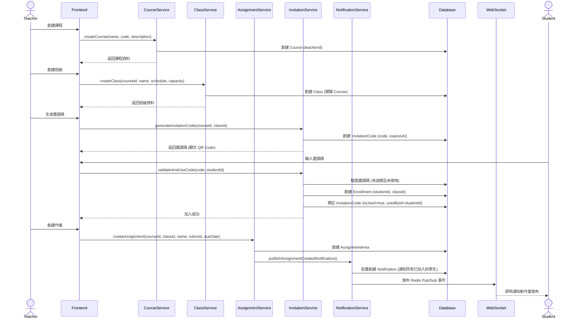
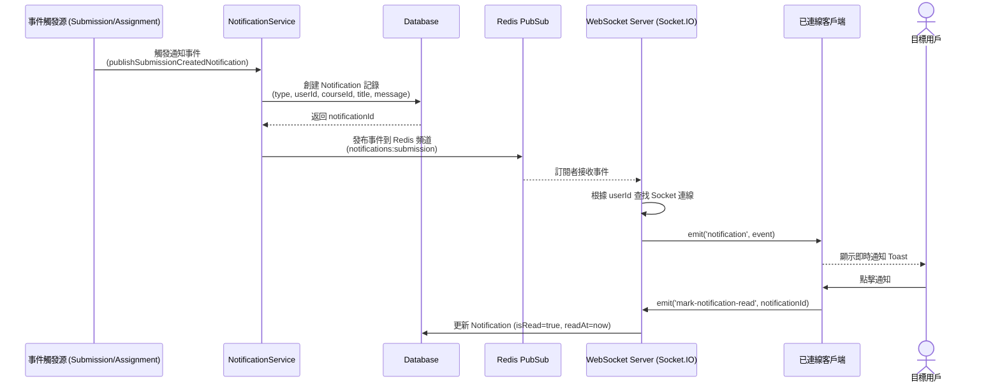
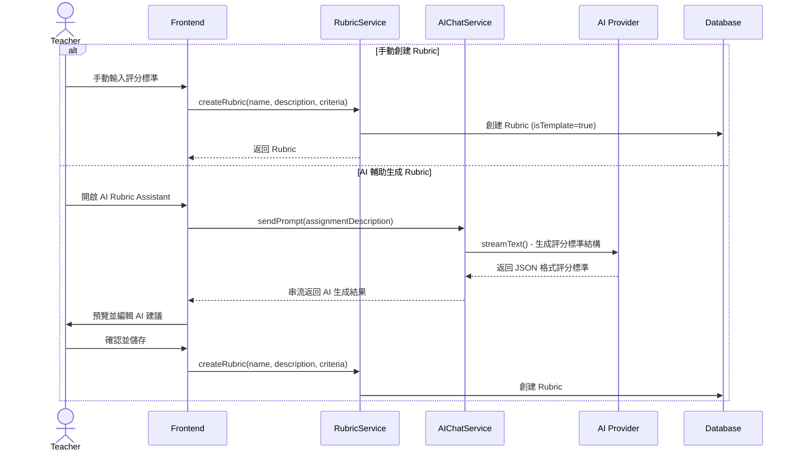
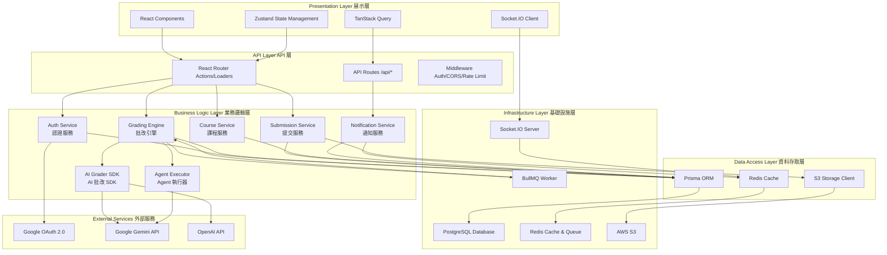
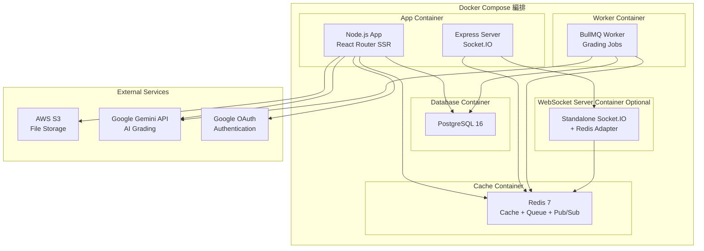

# 系統架構分析報告
## AI Grading System - Senior Architect Review

---

## 📋 執行摘要

本系統是一個基於 **React Router 7** 和 **Prisma** 的全端 AI 智能批改平台，支援角色管理、課程管理、作業提交與 AI 自動評分。系統採用現代化的微服務架構模式，運用異步任務隊列、WebSocket 即時通訊和多供應商 AI 整合。

**技術棧核心：**
- **Frontend:** React 19 + React Router 7 + TailwindCSS + Zustand
- **Backend:** Node.js + Express + Prisma ORM
- **Database:** PostgreSQL
- **Cache/Queue:** Redis + BullMQ
- **AI Providers:** Google Gemini (Agent + SDK) / OpenAI GPT-4o
- **Storage:** AWS S3
- **Real-time:** Socket.IO + Redis Pub/Sub
- **Auth:** Google OAuth 2.0

---

## 🔄 核心業務流程 (Core Workflows)

### 1️⃣ 使用者登入與角色選擇 (Authentication & Role Selection)

**流程描述：**
新使用者首次登入時，必須選擇角色 (STUDENT/TEACHER)，系統根據角色導向不同的儀表板。ADMIN 角色具有 TEACHER 的所有權限並可存取管理面板。

**關鍵步驟：**



**涉及服務與資料表：**
- **Services:** `auth.server.ts` (OAuth2Client, Session 管理)
- **Database:** `User` (role, hasSelectedRole, email, name, picture)
- **Routes:** `/auth/login`, `/auth/google/callback`, `/auth/select-role`

---

### 2️⃣ AI 智能批改作業提交 (AI-Powered Grading Submission)

**流程描述：**
學生提交作業後，系統將檔案上傳到 S3，解析 PDF 內容，並通過 BullMQ 異步隊列進行 AI 批改。批改結果會保存到資料庫並透過 WebSocket 即時推送給學生與教師。

**關鍵步驟：**



**涉及服務與資料表：**
- **Services:** 
  - `submission.server.ts` (提交管理)
  - `grading-engine.server.ts` (批改引擎核心)
  - `queue.server.ts` (BullMQ 隊列)
  - `agent-executor.server.ts` (AI Agent 執行)
  - `storage.server.ts` (S3 檔案管理)
  - `pdf-parser.server.ts` (PDF 解析)
- **Database:** 
  - `Submission` (學生提交記錄)
  - `GradingSession` (批改會話)
  - `GradingResult` (批改結果)
  - `UploadedFile` (上傳檔案)
  - `Rubric` (評分標準)
  - `AssignmentArea` (作業區域)
  - `AgentExecutionLog` (Agent 執行日誌)
- **Queue:** BullMQ `grading` queue
- **AI Models:** Gemini 2.5 Flash (Agent) / Gemini 2.5 Flash (SDK) / GPT-4o-mini

---

### 3️⃣ 課程與作業管理 (Course & Assignment Management)

**流程描述：**
教師創建課程、班級和作業區域，學生通過邀請碼加入班級。作業可以綁定評分標準 (Rubric)、設定截止日期並附加參考文件和自訂評分指示。

**關鍵步驟：**



**涉及服務與資料表：**
- **Services:**
  - `course.server.ts` (課程管理)
  - `class.server.ts` (班級管理)
  - `assignment-area.server.ts` (作業管理)
  - `invitation.server.ts` (邀請碼管理)
  - `enrollment.server.ts` (選課管理)
  - `notification.server.ts` (通知服務)
- **Database:**
  - `Course` (課程)
  - `Class` (班級)
  - `AssignmentArea` (作業區域)
  - `InvitationCode` (邀請碼)
  - `Enrollment` (選課記錄)
  - `Notification` (通知)

---

### 4️⃣ 即時通知系統 (Real-time Notification System)

**流程描述：**
系統使用 Redis Pub/Sub + Socket.IO 實現即時通知，當作業發布或學生提交時，相關用戶會收到即時通知。

**關鍵步驟：**



**涉及服務與資料表：**
- **Services:**
  - `notification.server.ts`
- **Database:**
  - `Notification`
- **WebSocket:** Socket.IO + Redis Adapter
- **Redis Channels:** `notifications:assignment`, `notifications:submission`

---

### 5️⃣ 評分標準 (Rubric) 設計與 AI 輔助生成

**流程描述：**
教師可以手動創建評分標準，或使用 AI Chat 功能生成評分標準。評分標準支援多層級分類結構 (Categories → Criteria → Levels)。

**關鍵步驟：**



**涉及服務與資料表：**
- **Services:**
  - `rubric.server.ts`
  - `ai-rubric.server.ts`
- **Database:**
  - `Rubric` (criteria 為 JSON 結構)
- **AI Provider:** Gemini 2.5 Flash

---

## 🏗️ 建議的關鍵架構圖

基於上述核心業務流程分析,建議繪製以下 **6 張關鍵架構圖** 來幫助新進工程師快速上手：

### 📌 1. System Context Diagram (系統上下文圖)

**目的：** 展示系統邊界及其與外部實體的互動關係

**應包含元件：**

| 元件類型 | 元件名稱 | 說明 |
|---------|---------|------|
| **外部實體 (Actors)** | Student (學生) | 提交作業、查看評分 |
| | Teacher (教師) | 創建課程、管理作業、審核評分 |
| | Admin (管理員) | 系統管理、權限控制 |
| **外部系統** | Google OAuth 2.0 | 使用者身份驗證 |
| | AWS S3 | 檔案儲存服務 |
| | Google Gemini API | AI 批改服務 (主要) |
| | OpenAI GPT-4o API | AI 批改服務 (備選) |
| **核心系統** | AI Grading System | 整個系統邊界 |

**資料流向：**
- **Student → System:** 作業提交、查看評分結果
- **Teacher → System:** 課程管理、作業發布、審核 AI 評分
- **System → Google OAuth:** 身份驗證請求
- **System → S3:** 檔案上傳/下載
- **System → AI Providers:** 批改請求
- **System → Users:** 即時通知 (WebSocket)

**建議工具：** PlantUML C4 Model Level 1 或 Mermaid

---

### 📌 2. Entity Relationship Diagram (ERD - 實體關係圖)

**目的：** 展示資料庫結構及表之間的關聯關係

**應包含核心資料表 (15+ tables)：**

| 資料表 | 說明 | 關鍵欄位 | 關聯關係 |
|--------|------|---------|---------|
| **User** | 用戶 | id, email, role, hasSelectedRole | 1→N: Course, Rubric, Submission, Enrollment |
| **Course** | 課程 | id, name, code, teacherId | N→1: User (teacher) <br> 1→N: Class, AssignmentArea |
| **Class** | 班級 | id, courseId, name, schedule, capacity | N→1: Course <br> 1→N: Enrollment, AssignmentArea |
| **AssignmentArea** | 作業區域 | id, courseId, classId, rubricId, dueDate, referenceFileIds, customGradingPrompt | N→1: Course, Class, Rubric <br> 1→N: Submission |
| **Rubric** | 評分標準 | id, userId, criteria (JSON), isTemplate | N→1: User <br> 1→N: AssignmentArea, GradingResult |
| **Submission** | 學生提交 | id, studentId, assignmentAreaId, filePath, status, finalScore, normalizedScore, aiAnalysisResult (JSON), thoughtSummary, thinkingProcess, gradingRationale, usedContext (JSON) | N→1: User, AssignmentArea |
| **GradingSession** | 批改會話 | id, userId, status, progress | N→1: User <br> 1→N: GradingResult |
| **GradingResult** | 批改結果 | id, gradingSessionId, uploadedFileId, rubricId, assignmentAreaId, status, result (JSON), thinkingProcess, gradingRationale, usedContext (JSON), agentSteps (JSON), confidenceScore, requiresReview | N→1: GradingSession, UploadedFile, Rubric, AssignmentArea <br> 1→N: AgentExecutionLog |
| **UploadedFile** | 上傳檔案 | id, userId, fileKey, parsedContent, parseStatus | N→1: User <br> 1→N: GradingResult |
| **AgentExecutionLog** | Agent 執行日誌 | id, gradingResultId, stepNumber, toolName, toolInput (JSON), toolOutput (JSON), reasoning | N→1: GradingResult |
| **Enrollment** | 選課記錄 | id, studentId, classId | N→1: User (student), Class |
| **InvitationCode** | 邀請碼 | id, code, courseId, classId, expiresAt, isUsed, usedById | N→1: Course, Class, User (usedBy) |
| **Notification** | 通知 | id, type, userId, courseId, assignmentId, title, message, isRead, data (JSON) | N→1: User, Course, AssignmentArea |
| **Chat** | AI 對話 | id, userId, title, context (JSON) | N→1: User <br> 1→N: Msg |
| **Msg** | 對話訊息 | id, chatId, role, content, data (JSON) | N→1: Chat |

**關鍵關聯關係：**
1. **User (Teacher) → Course → Class → AssignmentArea** (課程層次結構)
2. **User (Student) → Enrollment → Class** (選課關係)
3. **AssignmentArea → Submission → GradingResult → AgentExecutionLog** (批改鏈路)
4. **Rubric ← AssignmentArea / GradingResult** (評分標準應用)
5. **AssignmentArea → UploadedFile (referenceFiles)** (參考文件關聯 - JSON 陣列)

**建議工具：** dbdiagram.io, draw.io, 或 Prisma ERD Generator

---

### 📌 3. Sequence Diagram - AI Grading Flow (序列圖 - AI 批改流程)

**目的：** 詳細展示 AI 批改的完整時序互動

**涉及元件 (Components)：**

| 元件 | 說明 | 技術實現 |
|------|------|---------|
| Student | 學生用戶端 | React Frontend |
| API Gateway | API 路由層 | React Router Actions/Loaders |
| Submission Service | 提交服務 | `submission.server.ts` |
| Storage Service | 儲存服務 | `storage.server.ts` + AWS S3 SDK |
| PDF Parser | PDF 解析器 | `pdf-parser.server.ts` (Puppeteer) |
| Grading Engine | 批改引擎 | `grading-engine.server.ts` |
| BullMQ Queue | 任務隊列 | `queue.server.ts` (BullMQ) |
| Grading Worker | 批改工作者 | `workers/grading.server.ts` |
| Agent Executor | AI Agent 執行器 | `agent-executor.server.ts` (AI SDK 6) |
| Gemini API | AI 模型服務 | Google Gemini 2.5 Flash Agent |
| Database | 資料庫 | PostgreSQL + Prisma |
| WebSocket Server | WebSocket 伺服器 | Socket.IO + Redis Adapter |

**資料流向：**
1. Student → API: 上傳檔案 (multipart/form-data)
2. API → Storage: 上傳到 S3
3. API → PDF Parser: 解析 PDF 內容
4. API → Database: 創建 Submission + GradingSession + GradingResult
5. API → BullMQ: 加入批改任務
6. Worker → Database: 查詢必要資料 (File, Rubric, AssignmentArea)
7. Worker → Database: 載入 referenceDocuments 和 customInstructions
8. Worker → Agent Executor: 執行 AI Agent
9. Agent Executor → Gemini API: 批改請求 (包含 context)
10. Gemini API → Agent Executor: 返回評分 + agentSteps + confidence
11. Worker → Database: 保存結果到 GradingResult 和 Submission
12. Worker → WebSocket: 發送批改完成事件
13. WebSocket → Student: 即時通知

**參考我上面提供的 Mermaid Sequence Diagram (Workflow 2)**

---

### 📌 4. Sequence Diagram - Authentication Flow (序列圖 - 認證流程)

**目的：** 展示 Google OAuth 登入與角色選擇的完整流程

**涉及元件：**

| 元件 | 說明 | 技術實現 |
|------|------|---------|
| User | 使用者 | Browser |
| Frontend | 前端應用 | React Router |
| Auth Service | 認證服務 | `auth.server.ts` |
| Google OAuth | Google OAuth 2.0 | Google Auth Library |
| Database | 資料庫 | PostgreSQL (User table) |
| Session Store | 會話儲存 | Cookie-based Session |

**資料流向：**
參考我上面提供的 Mermaid Sequence Diagram (Workflow 1)

---

### 📌 5. Component Architecture Diagram (元件架構圖)

**目的：** 展示系統各層次的元件分層及依賴關係

**系統分層結構：**



**關鍵依賴說明：**

1. **Presentation → API Layer:**
   - React Components 通過 React Router Actions/Loaders 與後端互動
   - TanStack Query 用於資料快取和同步
   - Socket.IO Client 訂閱即時事件

2. **API → Business Logic:**
   - Auth Middleware 驗證請求
   - 各 Service 實現業務邏輯封裝

3. **Business Logic → Data Access:**
   - Prisma ORM 統一資料庫操作
   - Redis 提供快取和 Pub/Sub
   - S3 Client 管理檔案存取

4. **AI Grading 特殊路徑:**
   - Grading Engine → BullMQ → Worker → Agent Executor → Gemini API
   - 支援多模型切換 (Gemini Agent/SDK/OpenAI)

---

### 📌 6. Deployment Architecture Diagram (部署架構圖)

**目的：** 展示容器化部署結構及服務編排

**建議部署架構：**



**容器說明：**

| 容器名稱 | 服務 | Port | 環境變數 |
|---------|------|------|---------|
| **app** | Node.js + React Router + Express | 3000 | DATABASE_URL, REDIS_URL, AWS_*, GOOGLE_* |
| **worker** | BullMQ Worker (Grading) | N/A | DATABASE_URL, REDIS_URL, GOOGLE_* |
| **postgres** | PostgreSQL 16 | 5432 | POSTGRES_DB, POSTGRES_USER, POSTGRES_PASSWORD |
| **redis** | Redis 7 | 6379 | N/A |
| **websocket** (可選) | Socket.IO Server | 3001 | REDIS_URL |

**資料持久化：**
- PostgreSQL: Docker Volume
- Redis: Optional persistence (AOF/RDB)
- S3: 外部雲端儲存

---

## 📊 圖表內容定義總結

### 表 1: System Context Diagram 元件清單

| 元件類型 | 元件名稱 | 職責 | 互動方式 |
|---------|---------|------|---------|
| 外部實體 | Student | 提交作業、查看評分 | HTTPS, WebSocket |
| 外部實體 | Teacher | 管理課程、審核評分 | HTTPS, WebSocket |
| 外部實體 | Admin | 系統管理 | HTTPS |
| 外部系統 | Google OAuth | 身份驗證 | OAuth 2.0 |
| 外部系統 | AWS S3 | 檔案儲存 | S3 API |
| 外部系統 | Gemini API | AI 批改 | REST API |
| 核心系統 | AI Grading System | 完整系統 | - |

---

### 表 2: ERD 核心資料表關聯

| 主表 | 關聯表 | 關聯類型 | 外鍵 | 說明 |
|------|--------|---------|------|------|
| User | Course | 1:N | teacherId | 教師創建課程 |
| Course | Class | 1:N | courseId | 課程包含多個班級 |
| Class | Enrollment | 1:N | classId | 班級包含多個學生 |
| User | Enrollment | 1:N | studentId | 學生選課 |
| AssignmentArea | Submission | 1:N | assignmentAreaId | 作業有多個提交 |
| User | Submission | 1:N | studentId | 學生提交作業 |
| GradingSession | GradingResult | 1:N | gradingSessionId | 會話包含多個結果 |
| GradingResult | AgentExecutionLog | 1:N | gradingResultId | 批改記錄 Agent 日誌 |
| Rubric | AssignmentArea | 1:N | rubricId | 評分標準綁定作業 |
| AssignmentArea | GradingResult | 1:N | assignmentAreaId | 作業上下文綁定批改 (Feature 004) |

---

### 表 3: Sequence Diagram - AI Grading 關鍵步驟

| 步驟 | 來源元件 | 目標元件 | 訊息/資料 | 說明 |
|------|---------|---------|----------|------|
| 1 | Student | Upload API | POST /api/upload | 上傳檔案 |
| 2 | Upload API | S3 | putObject() | 存儲檔案 |
| 3 | Upload API | PDF Parser | parsePdf(fileKey) | 解析內容 |
| 4 | Submission Service | Database | CREATE Submission | 創建提交記錄 |
| 5 | Grading Engine | BullMQ | addJob(grade-submission) | 加入批改隊列 |
| 6 | Worker | Database | QUERY GradingResult + context | 查詢批改資料 |
| 7 | Worker | Agent Executor | executeGradingAgent() | 執行 AI Agent |
| 8 | Agent Executor | Gemini API | generateContent() | 批改請求 |
| 9 | Worker | Database | UPDATE GradingResult | 保存結果 |
| 10 | Worker | WebSocket | publish(grading-complete) | 即時通知 |

---

### 表 4: Component Architecture 服務依賴

| 服務層 | 服務名稱 | 依賴服務 | 技術實現 |
|--------|---------|---------|---------|
| Business Logic | Auth Service | Database, Google OAuth | `auth.server.ts` |
| Business Logic | Grading Engine | Database, BullMQ, Agent Executor | `grading-engine.server.ts` |
| Business Logic | Agent Executor | Gemini API, Database | `agent-executor.server.ts` |
| Business Logic | Notification Service | Database, Redis Pub/Sub, WebSocket | `notification.server.ts` |
| Data Access | Prisma ORM | PostgreSQL | `@prisma/client` |
| Infrastructure | BullMQ Worker | Redis, Grading Engine | `workers/grading.server.ts` |
| Infrastructure | WebSocket Server | Redis, Socket.IO | `websocket-server/` |

---

## 🎯 新進工程師 Onboarding 建議

### 📚 學習路徑

1. **第一週：環境設定與基礎理解**
   - 閱讀 Prisma Schema (`prisma/schema.prisma`) 理解資料模型
   - 瀏覽 `/app/routes` 理解路由結構
   - 研讀本架構分析文件

2. **第二週：核心業務流程**
   - 深入研究 Authentication Flow (跑一次完整登入流程)
   - 理解 AI Grading Flow (提交一次作業看完整批改過程)
   - 查看 BullMQ Dashboard (`/admin/queues`) 觀察任務執行

3. **第三週：AI 整合與進階功能**
   - 研讀 `agent-executor.server.ts` 理解 Agent-based Grading
   - 比較 Agent Grading vs AI SDK Grading 的差異
   - 測試 WebSocket 即時通知功能

4. **第四週：實作與貢獻**
   - 修復一個 Bug
   - 實作一個小功能
   - 撰寫單元測試

---

### 🛠️ 關鍵檔案清單

| 檔案路徑 | 說明 | 重要度 |
|---------|------|--------|
| `prisma/schema.prisma` | 資料庫 Schema 定義 | ⭐⭐⭐⭐⭐ |
| `app/services/auth.server.ts` | 認證服務 | ⭐⭐⭐⭐⭐ |
| `app/services/grading-engine.server.ts` | 批改引擎核心 | ⭐⭐⭐⭐⭐ |
| `app/services/agent-executor.server.ts` | AI Agent 執行器 | ⭐⭐⭐⭐ |
| `app/services/submission.server.ts` | 提交服務 | ⭐⭐⭐⭐ |
| `app/services/notification.server.ts` | 通知服務 | ⭐⭐⭐ |
| `app/services/queue.server.ts` | BullMQ 隊列設定 | ⭐⭐⭐ |
| `app/workers/grading.server.ts` | 批改 Worker | ⭐⭐⭐⭐ |
| `app/routes.ts` | 路由清單 | ⭐⭐⭐ |
| `docker-compose.dev.yaml` | 開發環境設定 | ⭐⭐⭐ |

---

### 📖 推薦閱讀順序

```mermaid
graph LR
    A[README.md] --> B[prisma/schema.prisma]
    B --> C[app/services/auth.server.ts]
    C --> D[app/services/submission.server.ts]
    D --> E[app/services/grading-engine.server.ts]
    E --> F[app/services/agent-executor.server.ts]
    F --> G[app/workers/grading.server.ts]
    G --> H[app/services/notification.server.ts]
    H --> I[實際操作測試]
```



---

## 💡 架構優勢與特色

1. **✅ 異步批改架構：** BullMQ 確保高並發下系統穩定性
2. **✅ 多 AI 供應商支援：** Gemini Agent / Gemini SDK / OpenAI 可切換
3. **✅ 上下文感知批改：** 支援參考文件與自訂批改指示 (Feature 004)
4. **✅ 可解釋 AI (XAI)：** 保存完整 Agent 思考過程與執行日誌
5. **✅ 即時通知系統：** Redis Pub/Sub + Socket.IO 實現低延遲通知
6. **✅ 角色權限管理：** STUDENT / TEACHER / ADMIN 清晰分離
7. **✅ 課程層次結構：** Course → Class → AssignmentArea 靈活設計
8. **✅ 容器化部署：** Docker Compose 簡化部署流程

---

## 🔮 未來擴展建議

1. **📊 分析儀表板：** 教師查看班級整體學習狀況
2. **🤖 更多 AI 模型：** 支援 Claude, Llama 等模型
3. **📝 批改歷史對比：** 學生查看多次提交的進步曲線
4. **🔔 多渠道通知：** Email, SMS, Push Notification
5. **🌐 多語言支援：** i18n 完整國際化
6. **📈 性能監控：** 整合 Prometheus + Grafana

---

## 📝 附錄：資料流向圖例

### AI Grading Data Flow (簡化版)

```
Student Upload
    ↓
[Upload API] → S3 Storage
    ↓
[PDF Parser] → Extract Text
    ↓
[Submission Service] → CREATE Submission + GradingSession + GradingResult
    ↓
[Grading Engine] → ADD BullMQ Job
    ↓
[Worker] → QUERY Database (File + Rubric + AssignmentArea)
    ↓
[Worker] → LOAD Reference Documents + Custom Instructions
    ↓
[Agent Executor] → CALL Gemini API with Context
    ↓
[Gemini API] → RETURN Grading Result + Agent Steps + Confidence
    ↓
[Worker] → UPDATE Database (GradingResult + Submission)
    ↓
[WebSocket] → NOTIFY Student + Teacher
```

---

**文件版本：** 1.0  
**最後更新：** 2025-12-25  
**撰寫者：** Senior System Architect (AI Assistant)  
**審核狀態：** 待使用者審核
