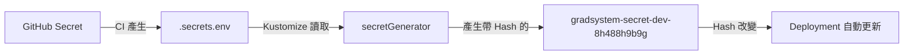

# Kustomize Deployment with secretGenerator

## 概念說明

使用 Kustomize 的 `secretGenerator` 可以自動在 Secret 名稱後加上 Hash 值。
當 Secret 內容改變時，Hash 會變，這會自動觸發 Pod 滾動更新。

```
gradsystem-secret-dev → gradsystem-secret-dev-8h488h9b9g
                                             ↑ 自動 Hash
```

---

## 方法 1: 一鍵打包法 (推薦 - 適合 5+ 個變數)

把**整個 `.secrets.env` 的內容**存成單一 GitHub Secret，CI 只需一行就能產生檔案。

### 步驟 1: 設定 GitHub Secret

1. 在本機整理好 `.secrets.env` 內容：
```properties
DATABASE_URL=postgresql://user:pass@db:5432/db
REDIS_PASSWORD=superlongpassword123
MINIO_ROOT_PASSWORD=minio-secret
OLLAMA_API_KEY=ollama-key
THEME_SECRET=theme-secret
AUTH_SECRET=auth-secret
GOOGLE_CLIENT_ID=google-client-id
GOOGLE_CLIENT_SECRET=google-client-secret
GOOGLE_REDIRECT_URI=https://your-redirect-uri
GEMINI_API_KEY=gemini-key-1
GEMINI_API_KEY2=gemini-key-2
GEMINI_API_KEY3=gemini-key-3
AUTH_KEY=auth-key
OPENAI_API_KEY=openai-key
```

2. 去 **GitHub Repo → Settings → Secrets → Actions**
3. 新增 Secret：
   - Dev K3s: `DEV_K3S_ENV_FILE`
   - Prod K3s: `PROD_K3S_ENV_FILE`
   - Dev K8s: `DEV_K8S_ENV_FILE`

4. 把整個內容貼進去

### 步驟 2: 修改 deploy.yml

```yaml
- name: Deploy to K3s
  uses: appleboy/ssh-action@master
  with:
    host: ${{ secrets.SERVER_HOST }}
    username: ${{ secrets.SERVER_USER }}
    key: ${{ secrets.SERVER_SSH_KEY }}
    command_timeout: 10m
    script: |
      set -e
      export KUBECONFIG=~/.kube/config
      cd ~/gradsystem
      
      # 1. 更新 repo
      git fetch origin ${{ github.ref_name }}
      git reset --hard origin/${{ github.ref_name }}
      
      # 2. 決定 overlay 和 secret
      if [ "${{ github.ref_name }}" = "master" ]; then
        OVERLAY_PATH="k8s/main-service/overlays/prod-k3s"
        SECRET_CONTENT='${{ secrets.PROD_K3S_ENV_FILE }}'
      else
        OVERLAY_PATH="k8s/main-service/overlays/dev-k3s"
        SECRET_CONTENT='${{ secrets.DEV_K3S_ENV_FILE }}'
      fi
      
      # 3. 一行產生 .secrets.env ✨
      printf "%s" "$SECRET_CONTENT" > $OVERLAY_PATH/.secrets.env
      
      # 4. 使用 Kustomize 部署
      kubectl apply -k $OVERLAY_PATH
      
      # 5. 清理
      rm -f $OVERLAY_PATH/.secrets.env
      
      echo "Deployment completed!"
```

### 優點
- ✅ `deploy.yml` 永遠不用改，加新變數只要編輯 GitHub Secret
- ✅ 不管 5 個還是 50 個變數，CI 都只有一行
- ✅ 避免 workflow 變成幾百行字串拼接

---

## 方法 2: Heredoc 法 (適合 < 5 個變數)

如果希望分開管理每個 Secret，但又比 `echo` 整潔：

```yaml
- name: Deploy
  uses: appleboy/ssh-action@master
  with:
    host: ${{ secrets.SERVER_HOST }}
    username: ${{ secrets.SERVER_USER }}
    key: ${{ secrets.SERVER_SSH_KEY }}
    script: |
      cd ~/gradsystem
      OVERLAY_PATH="k8s/main-service/overlays/dev-k3s"
      
      # Heredoc 語法 - 像寫設定檔一樣
      cat > $OVERLAY_PATH/.secrets.env << 'EOF'
      DATABASE_URL=${{ secrets.DATABASE_URL }}
      REDIS_PASSWORD=${{ secrets.REDIS_PASSWORD }}
      MINIO_ROOT_PASSWORD=${{ secrets.MINIO_ROOT_PASSWORD }}
      OLLAMA_API_KEY=${{ secrets.OLLAMA_API_KEY }}
      EOF
      
      kubectl apply -k $OVERLAY_PATH
      rm -f $OVERLAY_PATH/.secrets.env
```

---

## Mars K8s 部署 (dev-k8s)

```yaml
- name: Deploy to Mars K8s
  if: github.ref_name == 'development'
  uses: appleboy/ssh-action@master
  with:
    host: ${{ secrets.MARS_SERVER_HOST }}
    username: ${{ secrets.MARS_SERVER_USER }}
    key: ${{ secrets.MARS_SERVER_SSH_KEY }}
    script: |
      set -e
      export KUBECONFIG=~/.kube/config
      cd ~/gradsystem
      
      git fetch origin development
      git reset --hard origin/development
      
      OVERLAY_PATH="k8s/main-service/overlays/dev-k8s"
      
      # 一鍵產生 .secrets.env
      printf "%s" '${{ secrets.DEV_K8S_ENV_FILE }}' > $OVERLAY_PATH/.secrets.env
      
      kubectl apply -k $OVERLAY_PATH
      rm -f $OVERLAY_PATH/.secrets.env
      
      echo "Mars deployment completed!"
```

---

## GitHub Secrets 設定清單

### 連線相關
| Secret 名稱 | 說明 |
|-------------|------|
| `SERVER_HOST` | K3s 伺服器 IP |
| `SERVER_USER` | SSH 使用者名稱 |
| `SERVER_SSH_KEY` | SSH 私鑰 |
| `MARS_SERVER_HOST` | Mars K8s 伺服器 IP |
| `MARS_SERVER_USER` | Mars SSH 使用者 |
| `MARS_SERVER_SSH_KEY` | Mars SSH 私鑰 |

### 環境檔案 (一鍵打包法)
| Secret 名稱 | 用途 |
|-------------|------|
| `DEV_K3S_ENV_FILE` | dev-k3s 的 .secrets.env 完整內容 |
| `PROD_K3S_ENV_FILE` | prod-k3s 的 .secrets.env 完整內容 |
| `DEV_K8S_ENV_FILE` | dev-k8s (Mars) 的 .secrets.env 完整內容 |

---

## secretGenerator 的運作原理



| 特性 | 說明 |
|------|------|
| **自動 Hash** | Secret 名稱自動加上內容 Hash |
| **自動 Rollout** | Hash 改變時觸發 Pod 更新 |
| **GitOps 友好** | `.secrets.env` 不進 git |
