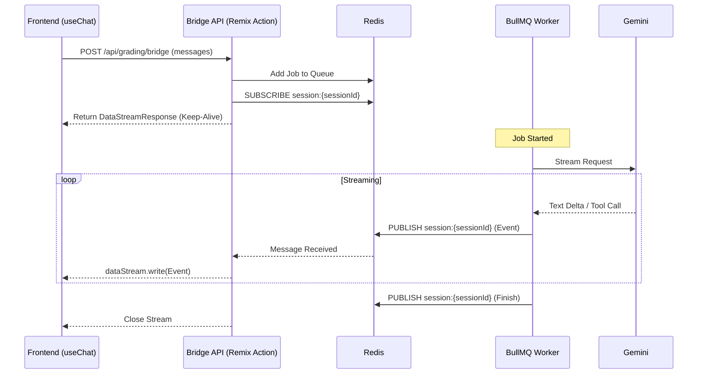

# Spec 013: Streaming Bridge Architecture (BullMQ + Vercel AI SDK UI)

## 1. Background & Goal

The current system uses **BullMQ + Redis** for asynchronous grading to ensure the stability of long-running tasks. However, the frontend team wishes to use the **Vercel AI SDK UI (`useChat`)** to simplify development and achieve a standardized Streaming experience.

This specification aims to design a **"Streaming Bridge"** architecture that combines the strengths of both approaches:

1. **Backend Stability:** Retain BullMQ to handle long tasks, avoiding HTTP Timeouts.
2. **Frontend Standardization:** The frontend uses the standard `useChat` hook, eliminating the need to maintain custom WebSocket/SSE logic.

## 2. Tech Stack Versions

* **ai**: `^6.0.0-beta.92` (Core SDK)
* **@ai-sdk/react**: `^3.0.0-beta.92` (Frontend Hooks)
* **Redis**: Used for Pub/Sub messaging

## 3. Architecture Design

### 3.1 Data Flow



### 3.2 Redis Protocol Definition

The Worker and Bridge communicate via the Redis Channel `session:{sessionId}`. The message format is as follows:

```typescript
type BridgeEvent = 
  | { type: 'text-delta'; content: string }
  | { type: 'tool-call'; toolCallId: string; toolName: string; args: any }
  | { type: 'tool-result'; toolCallId: string; result: any }
  | { type: 'error'; error: string }
  | { type: 'finish'; result?: any };

```

## 4. Implementation Plan

### 4.1 File Change List

#### 1. `app/services/agent-executor.server.ts` (Modify)

* **Goal:** Enhance the streaming loop in `executeGradingAgent`.
* **Changes:**
* Inside the `for await (const part of resultStream.fullStream)` loop.
* In addition to the existing `text-delta`, add Redis Publish logic for `tool-call` and `tool-result`.
* Ensure all events comply with the `BridgeEvent` format.


#### 2. `app/routes/api.grading.bridge.ts` (New)

* **Goal:** Create an AI SDK compatible API Endpoint.
* **Logic:**
* Receive POST requests.
* Generate a `sessionId`.
* Add the grading request to the BullMQ Queue.
* Use `createDataStreamResponse` (AI SDK v6) to build the response.
* In the `execute` callback, subscribe to Redis and write received messages to the `dataStream`.


#### 3. `app/types/bridge.ts` (New)

* **Goal:** Define the TypeScript interfaces for Redis messages to ensure type safety between the Worker and the Bridge.

## 5. Key Code Snippets (Reference)

### Bridge API (`app/routes/api.grading.bridge.ts`)

```typescript
import { createDataStreamResponse } from 'ai';

return createDataStreamResponse({
  execute: async (dataStream) => {
    const sub = redis.duplicate();
    await sub.subscribe(`session:${sessionId}`);
    
    sub.on('message', (channel, message) => {
      const event = JSON.parse(message);
      switch(event.type) {
        case 'text-delta':
          dataStream.writeTextDelta(event.content);
          break;
        case 'tool-call':
          dataStream.writeToolCall({ ... });
          break;
        case 'tool-result':
          dataStream.writeToolResult({ ... });
          break;
        // ...
      }
    });
  }
});

```

### Worker Publisher (`app/services/agent-executor.server.ts`)

```typescript
// Inside the stream loop
if (part.type === 'tool-call') {
  await redis.publish(channel, JSON.stringify({
    type: 'tool-call',
    toolCallId: part.toolCallId,
    toolName: part.toolName,
    args: part.args
  }));
}

```

## 6. Considerations

1. **Timeout Handling:** While BullMQ itself does not timeout, the frontend HTTP connection might be cut off by Load Balancers (e.g., Vercel/Cloudflare). The Bridge API needs to implement Heartbeats or ensure the platform configuration allows for long connections.
2. **Concurrency Control:** Redis Pub/Sub operates in broadcast mode. Ensure `sessionId` is unique and does not conflict with other requests.
3. **Error Handling:** If the Worker fails, an `error` event must be sent to notify the frontend to interrupt the stream.